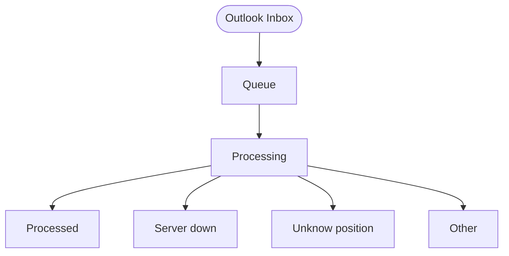

# FitScan - Enterprise Applicant Tracking System (ATS)

A comprehensive, enterprise-grade Applicant Tracking System built with modern web technologies, featuring advanced applicant management, AI-powered matching, automated workflows, and seamless integrations.


---

## 🎯 Overview

FitScan is a modern, scalable Applicant Tracking System designed to streamline recruitment processes through intelligent automation, comprehensive applicant management, and powerful analytics.

### Key Value Propositions

- **AI-Powered applicant Matching**: Intelligent job-applicant matching using Google Gemini API
- **Real-time Collaboration**: Live updates and notifications via Server-Sent Events
- **Enterprise Security**: Role-based access control with granular permissions
- **Scalable Architecture**: Built on modern tech stack for high performance
- **Comprehensive Analytics**: Detailed insights into recruitment performance
- **Workflow Automation**: N8N integration for custom automation workflows

---

## 🚀 Features

### 📊 Dashboard & Analytics
- Real-time metrics and KPIs
- Recruitment pipeline visualization
- Performance analytics and SLA tracking

### 👥 applicant Management
- Comprehensive profiles with custom fields
- Resume upload, parsing, and version history
- Stage tracking with Kanban board
- AI-powered resume parsing and matching
- Evaluation system with expertise skills and personality traits

### 💼 Position Management
- Job posting creation with rich text editor
- Headcount and SLA tracking
- Interviewer assignment and expertise skills configuration

### 👤 User & Access Management
- Role-Based Access Control (RBAC)
- Azure AD SSO integration
- Granular permissions and user groups

### 📋 Task Management
- Personal task board for recruiters
- Kanban and list views with filtering

### ⚙️ System Configuration
- Custom fields and recruitment stages
- Webhook integration and notifications
- Theme customization and API documentation

---

## 🛠️ Technology Stack

| Layer | Technology |
|-------|------------|
| **Frontend** | Next.js 15.5.2, React 18, TypeScript, Tailwind CSS, ShadCN UI |
| **Backend** | Next.js API Routes, Prisma 6.11.0, NextAuth.js |
| **Database** | PostgreSQL 15 |
| **Storage** | MinIO (S3 Compatible) |
| **AI** | Google Gemini API (Direct) |
| **Real-time** | Server-Sent Events (SSE) |
| **Automation** | N8N Workflow Engine |
| **DevOps** | Docker, PM2 |

---

## 🚀 Quick Start

### Docker Deployment (Recommended)

```bash
# Clone the repository
git clone <repository-url>
cd studio-2

# Configure environment
cp env.local.template .env.local

# Deploy with Docker Compose
docker-compose up -d
```

### Access Points

| Service | URL | Default Credentials |
|---------|-----|---------------------|
| **Main App** | http://localhost:8021 | admin@ncc.com / nccadmin |
| **MinIO Console** | http://localhost:9848 | minioadmin / minioadmin |
| **N8N Automation** | http://localhost:8921 | admin / admin |

⚠️ **Security**: Change all default passwords immediately after first login.

---

## 🔌 n8n Workflow Setup

FitScan uses **n8n** for background processing and email automation. Follow these steps to set up the automation layer:

### 1. Access n8n
- Open the n8n console at [http://localhost:8921](http://localhost:8921).
- Use default credentials: `admin` / `admin`.

### 2. Import Workflows
Import the following JSON files located in `docs/n8n workflows/`:
1.  **FitScan [Inbound applicant].json**: Handles incoming resumes via Outlook.
2.  **FitScan [Process applicant].json**: Orchestrates AI parsing and scoring.
3.  **Fitscan [run process queue].json**: Scheduled task to process the background queue.

### 3. Configure Credentials
Inside n8n, go to **Credentials** and add:
- **Google Gemini API**: Create a "Google Gemini(PaLM)" credential with your `GOOGLE_API_KEY`.
- **Microsoft Outlook**: Create a "Microsoft Outlook OAuth2" credential to monitor your inbox.
- **App API Token**: Create a "Header Auth" credential with:
    - **Name**: `Authorization`
    - **Value**: `Bearer <Your_System_API_Key>` (Generate this in Settings > API Keys).

### 4. Outlook Folder Structure
The **Inbound applicant** workflow expects specific folders in your Outlook account to categorize processing status.

#### Example Folder Hierarchy:


- **Queue**: Primary folder monitored for new incoming resumes.
- **Processing**: Temporary folder for emails currently being parsed.
- **Processed**: Successfully handled and uploaded applicants.
- **Server down**: Fallback for when the FitScan API is unreachable.
- **Unknow position**: For applicants where the AI cannot identify the applied position.
- **Other**: For non-applicant or irrelevant emails.

### 5. Windmill Integration (HTML-to-PDF)
The workflow integrates with a **Windmill** worker for high-fidelity HTML to PDF conversion:
- **Actual Endpoint**: `https://ncc-windmill.qsncc.com/api/w/analyst-hub/jobs/run_wait_result/p/f/windmill/fitscan_convert_html_pdf`
- **Method**: `POST`
- **Purpose**: Converts HTML-only applicant profiles (e.g., from JobBKK) into standardized PDFs for AI parsing.
- **Configuration**: Ensure the `HTML to PDF` node in n8n has the correct Bearer token for the Windmill API.

### 6. Activate Workflows
- Open each imported workflow.
- Ensure all nodes are correctly linked to your credentials.
- Click **"Active"** toggle in the top-right corner.

---

## 📚 Documentation

Detailed documentation is available in the `docs/` directory:

### 🗂 Documentation Index

#### 📏 Standards
*   [Sustainable Engineering](docs/Sustainable%20Engineering.md) - **Core engineering principles, code quality, and testing standards.**

#### 🏗 Architecture
*   [Architecture Overview](docs/architecture/Architecture.md) - High-level system design and stack.
*   [Security Architecture](docs/architecture/Security.md) - Auth, RBAC, and data protection.
*   [SSE Mechanism](docs/architecture/SSE%20Mechanism.md) - Real-time updates architecture.
*   [System Configuration](docs/architecture/System%20Configuration.md) - Dynamic settings management.
*   [Calculation Logic](docs/architecture/Calculation%20Logic.md) - Math behind fit scores and analytics.

#### 🔄 Workflows & Business Logic
*   [Authentication Flow](docs/workflows/Authentication%20Flow.md) - Login, SSO, and session handling.
*   [Job Matching](docs/workflows/Job%20Matching%20Flow.md) - AI applicant scoring logic.
*   [Evaluation](docs/workflows/Evaluation%20Flow.md) - applicant assessment process.
*   [AI Search](docs/workflows/AI%20Search%20Flow.md) - Natural language search internals.
*   [SLA Tracking](docs/workflows/SLA%20Flow.md) - Performance monitoring logic.
*   [Notifications](docs/workflows/Notification%20Flow.md) - Alerting system.
*   [Process Queue](docs/workflows/Process%20Queue%20Flow.md) - Background job handling.
*   [Backup & Recovery](docs/workflows/Backup%20&%20Recovery%20Flow.md) - Business continuity processes.
*   [Audit Logging](docs/workflows/Audit%20Flow.md) - Security and activity tracking.
*   [Custom Fields](docs/workflows/Custom%20Fields%20Flow.md) - Extensibility logic.

#### 👩‍💻 Development
*   [Development Guide](docs/development/Development%20Guide.md) - Local setup and contribution workflow.
*   [API Specification](docs/development/API%20Specification.md) - REST API endpoints.
*   [API Overview](docs/development/API%20Overview.md) - API design principles.
*   [CLI Reference](docs/development/CLI%20Reference.md) - Management scripts.
*   [Troubleshooting](docs/development/Troubleshooting.md) - Common fixes and debug steps.

#### 🚀 Infrastructure
*   [Installation Guide](docs/infrastructure/Installation%20Guide.md) - Deployment and setup.
*   [Deployment Flow](docs/infrastructure/Deployment%20Flow.md) - CI/CD and release pipeline.
*   [Migration Guide](docs/infrastructure/Migration%20Guide.md) - Database and system upgrades.
*   [Backup & Recovery Ops](docs/infrastructure/Backup%20&%20Recovery.md) - Technical recovery steps.

#### 🗄 Database
*   [Entity Relationship Diagram](docs/database/Entity%20Relationship%20Diagram.md) - Database schema overview.
*   [Design Generator](docs/database/Database%20Design.md) - Schema generation tools.
*   [Start Comments Flow](docs/database/Database%20Comments%20Flow.md) - Database documentation sync.

#### 🔌 Integrations
*   [n8n Integration](docs/integrations/n8n%20Integration.md) - Automation workflow setup.

#### 📋 Requirements
*   [Business Requirements (BRD)](docs/requirements/Business%20Requirements%20Document.md)
*   [System Requirements (SRS)](docs/requirements/Software%20Requirements%20Specification.md)

#### 🧪 Testing
*   [Test Cases](docs/testing/TEST_CASES.csv) - Manual test scenarios.

---

## 🕵️ Gap Analysis: Missing Documentation

To reach full sustainable engineering maturity, the following documents are **missing or need creation**:

### 1. 📘 User Guide
*   **Target**: Recruiters, Hiring Managers.
*   **Gap**: We have technical flows, but no "How-To" guide for using the UI (e.g., "How to create a position", "How to interview a applicant").
*   **Recommendation**: Create `docs/USER_GUIDE.md` or a wiki.

### 2. 🚨 Operational Runbooks
*   **Target**: DevOps / On-call Engineers.
*   **Gap**: `TROUBLESHOOTING.md` is good for devs, but we need specific incident response guides (e.g., "What to do if MinIO is down", "How to restore a single table").
*   **Recommendation**: Create `docs/infrastructure/RUNBOOKS.md`.

### 3. 📖 Glossary
*   **Target**: All Stakeholders.
*   **Gap**: Ambiguous terms like "Fit Score", "Stage", "Grade" vs "Level" need clear definitions.
*   **Recommendation**: Create `docs/GLOSSARY.md`.

### 4. 🎨 Design System & UI Kit
*   **Target**: Frontend Developers, Designers.
*   **Gap**: No documentation on standard colors, typography, or component usage (ShadCN usage).
*   **Recommendation**: Create `docs/development/DESIGN_SYSTEM.md`.

### 5. 🔁 Release Notes / Changelog
*   **Target**: All.
*   **Gap**: Ensure a `CHANGELOG.md` exists in the root to track version history (Semantic Versioning).
*   **Recommendation**: Maintain a `CHANGELOG.md` in the project root.


---

## 🔧 Essential Scripts

### Development
```bash
npm run dev                 # Start development server
npm run build               # Build for production
npm run lint                # Run ESLint
```

### Database
```bash
npm run db:studio           # Open Prisma Studio
npm run db:seed             # Seed database
npm run db:create-admin     # Create admin user
```

### System Settings CLI
```bash
npm run settings:list       # List all settings
npm run settings:enable-basic-auth   # Enable basic auth
```

See [CLI Reference](docs/development/CLI%20Reference.md) for complete script documentation.

---

## 🔐 Authentication

### Methods
1. **Email/Password**: Traditional login with bcrypt hashing
2. **Azure AD SSO**: Enterprise single sign-on

### Default Admin
- **Email**: `admin@ncc.com`
- **Password**: `nccadmin`

See [Security Documentation](docs/architecture/Security.md) for configuration details.

---

## 🏗️ Project Structure

```
studio-2/
├── src/
│   ├── app/           # Next.js App Router (pages + API)
│   ├── components/    # React components
│   ├── lib/           # Utility libraries
│   ├── hooks/         # React hooks
│   └── types/         # TypeScript types
├── prisma/            # Database schema and migrations
├── scripts/           # Utility scripts
├── docs/              # Documentation
└── docker-compose.yml # Docker configuration
```

---

## 🤝 Contributing

See [CONTRIBUTING.md](CONTRIBUTING.md) for guidelines.

---

## 📄 License

This project is licensed under the MIT License.

---

## 🆘 Support

- Check documentation at `/docs` in the application
- Review API documentation at `/api-docs`
- See [Troubleshooting Guide](docs/development/Troubleshooting.md)

---

**FitScan** - Modern, scalable, and feature-rich Applicant Tracking System

Built with ❤️ using Next.js, TypeScript, and PostgreSQL