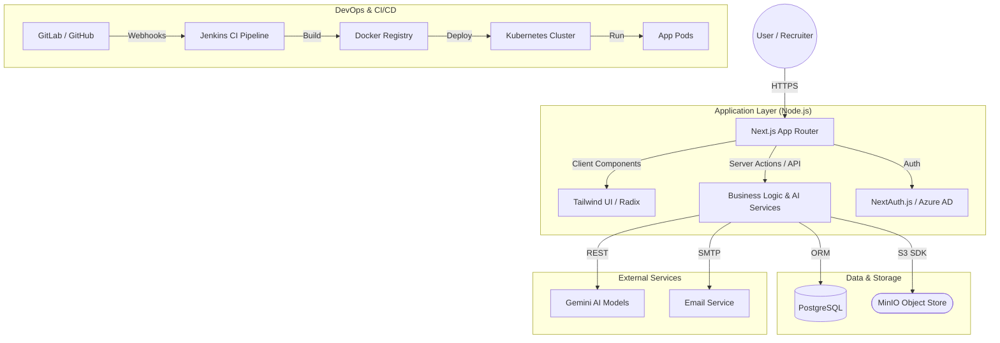

# FitScan System Architecture Overview

This document provides a high-level overview of the FitScan architecture, describing the core technologies, data flow, and infrastructure components that power the system.

## 🏗️ Core Technology Stack

FitScan is built as a modern full-stack web application using a highly scalable and modular architecture.

| Layer | Technology |
| :--- | :--- |
| **Frontend** | [Next.js 15](https://nextjs.org/) (App Router), [React 18](https://reactjs.org/), [Tailwind CSS](https://tailwindcss.com/) |
| **Backend** | Next.js API Routes (Node.js), [Prisma ORM](https://www.prisma.io/) |
| **Database** | [PostgreSQL](https://www.postgresql.org/) |
| **Authentication** | [NextAuth.js 5](https://next-auth.js.org/) (Azure AD & Basic Auth) |
| **Object Storage** | [MinIO](https://min.io/) (S3-compatible) |
| **AI Integration** | Gemini (via @google/generative-ai) for Resume Parsing & Job Matching |
| **Infrastructure** | [Docker](https://www.docker.com/), [Kubernetes](https://kubernetes.io/), [Jenkins](https://www.jenkins.io/) |

---

## 🗺️ High-Level Architecture Diagram

---

## 🔑 Core Concepts & Workflows

### 1. Recruitment Pipeline
The system manages the lifecycle of a candidate from initial sourcing to hiring.
- **Positions**: Defined with specific criteria and assigned recruiters.
- **Candidates**: Sourced from various outlets; resumes are uploaded and parsed.
- **Matching**: AI calculates a **Fit Score** by comparing candidate skills against position requirements.
- **Stages**: Configurable pipeline stages (Screening, Interview, Offer, etc.).

### 2. Resume Processing Flow
1. **Upload**: User uploads a PDF/Docx resume.
2. **Queue**: The file is stored in **MinIO** and an entry is created in `UploadQueue`.
3. **Parsing**: AI services parse the file content into structured JSON.
4. **Ingestion**: Structured data is saved to the `Candidate` table in PostgreSQL.

### 3. Security & Identity
- **Dual Auth**: Supports both standard email/password and enterprise **SSO via Azure AD**.
- **RBAC**: Role-Based Access Control (Admin, Recruiter, Hiring Manager, Viewer).
- **Audit Logging**: Every sensitive action (logins, transitions, data changes) is tracked in `AuditLog` and `UserActivityLog`.

### 4. Infrastructure & Deployment
- **Containerization**: The app is containerized using an optimized multi-stage `Dockerfile`.
- **CI/CD**: Automated via **Jenkins**. It handles building images, pushing to a private GitLab registry, and triggering deployments.
- **Orchestration**: Managed in production via **Kubernetes** (using ConfigMaps, Secrets, and Ingress manifests).

---

## 📁 Key Directory Structure

- `/src/app`: Next.js pages and API routes.
- `/src/components`: Reusable React components.
- `/src/lib`: Core utility functions (DB connection, AI logic, S3 helpers).
- `/prisma`: Database schema and migration files.
- `/scripts`: Migration, seed, and maintenance scripts.
- `/k8s`: Kubernetes deployment manifests.
