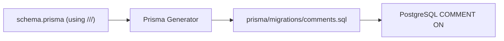

# Database Field Description Flow

FitScan implements "Living Documentation" for the database schema. This ensure that field-level descriptions are synchronized between the source code (`schema.prisma`) and the physical PostgreSQL database.

---

## 🏗️ Architecture

The system uses a Prisma generator to convert source code comments into SQL `COMMENT ON` statements.



---

## 📝 Writing Descriptions

To document a model or field, use triple-slash (`///`) comments. These are picked up by both the Prisma Client (for Intellisense) and the database generator.

```prisma
/// User - Core identity table
model User {
  /// Unique identifier (UUID)
  id    String @id @db.Uuid
  /// Email used for identity
  email String @unique
}
```

---

## 🔄 Synchronizing to Database

Database comments are not applied during standard `prisma migrate` runs. They must be synced explicitly using the documentation utility.

### Step 1: Generate SQL
Run the following to refresh the SQL script:
```bash
npx prisma generate
```
This updates `./prisma/migrations/comments.sql`.

### Step 2: Apply to Database
Run the utility script to execute the `COMMENT ON` statements:
```bash
npm run db:comments
```

---

## 🔍 Viewing Descriptions

Once applied, you can view these descriptions in any standard database client:
- **DBeaver/pgAdmin**: Look at the "Description" or "Comment" column in the table/column properties.
- **SQL**: Run `SELECT description FROM pg_description;`

---

## 📋 Benefits
1.  **Onboarding**: New developers see field purposes in their IDE and DB client simultaneously.
2.  **Governance**: No undocumented fields allowed in production migrations.
3.  **Audit**: Security-sensitive fields (e.g., `twoFactorSecret`) are clearly flagged at the database level.
