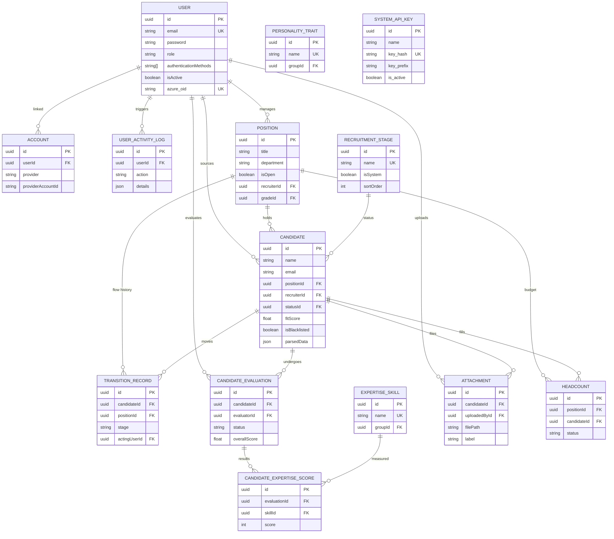

# FitScan Database ERD (Entity Relationship Diagram)

This document visualizes the **Core Data Flows** of the FitScan application. 

> [!NOTE]
> This Mermaid diagram focuses on essential relationships and critical entities to maintain high-level clarity. For a **holistic** breakdown of every database field, domain descriptions, and business logic constraints, please refer to the [ERD Specialist Guide](./ERD.md).

---

---

## 🛠️ Field Documentation System
FitScan uses a "Code as Documentation" approach. Detailed field descriptions (visible in your DB client) are maintained directly in the source code:

1.  **Source**: `prisma/schema.prisma` using `///` comments.
2.  **Generator**: `prisma-db-comments-generator`.
3.  **Sync**: Run `npm run db:comments` to apply these descriptions to the live PostgreSQL database.

For a full guide on this process, see [Database Comments Flow](./DATABASE_COMMENTS_FLOW.md).
