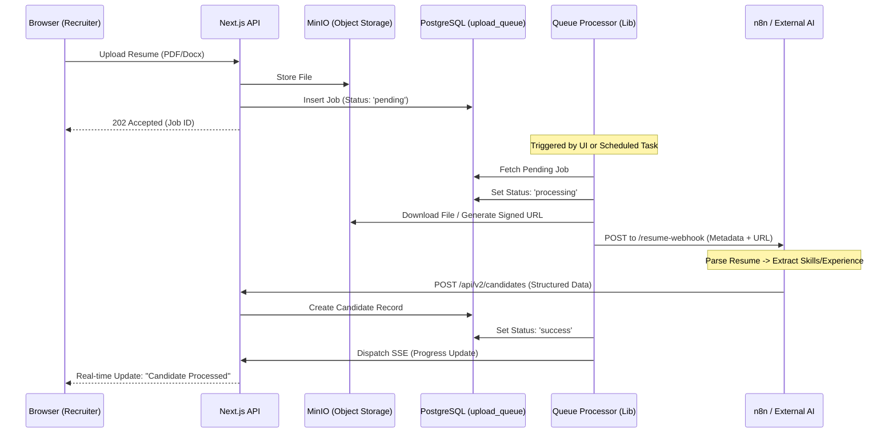

# FitScan Process Queue Flow

FitScan uses an asynchronous queue to handle resume processing, ensuring that heavy tasks like PDF parsing and AI analysis don't block the user interface.

---

## 🔄 Resume Processing Lifecycle

The lifecycle of a resume from upload to database ingestion follows this flow:

---

## 🛠️ Key Components

### 1. The Queue Table (`upload_queue`)
Stores the state of every upload.
- **Fields**: `status` (pending, processing, success, failed), `file_path`, `error_details`, `webhook_payload`.
- **Custom Data**: Stores additional metadata like `targetPositionId` in a JSONB field to be passed to the processor.

### 2. The Processor (`uploadQueueProcessor.ts`)
The engine that drives the queue.
- **Memory Optimization**: Streams files from MinIO to avoid memory spikes with large documents.
- **Idempotency**: Generates unique keys to prevent the same resume from being processed twice if n8n retries.
- **Error Handling**: Captures logs and stack traces into the database if the external service fails.

### 3. Retry Logic (`uploadQueueRetry.ts`)
- Implements **Exponential Backoff** for transient network failures.
- Captures a history of retry attempts in the `webhook_payload` for audit trail visibility.

---

## ⚙️ Trigger Mechanisms

| Trigger Method | Description |
| :--- | :--- |
| **Immediate** | Triggered automatically after a successful file upload to MinIO. |
| **Bulk Action** | Triggered by the recruiter from the "Process Queue" dashboard for legacy or failed uploads. |
| **Blocking API** | `/api/upload-queue/blocking-process` - Waits for the process to finish before responding (used for single uploads). |
| **Auto-Retry** | Scheduled system task that finds `failed` jobs and retries them based on the retry configuration. |

---

## 📊 Status Transitions
- `pending`: Job created, waiting for resources.
- `processing`: Processor has grabbed the job and is talking to the AI service.
- `success`: AI service replied, and candidate data is synced.
- `failed`: An error occurred (e.g., file too large, n8n offline). The `error_details` field contains the stack trace.
