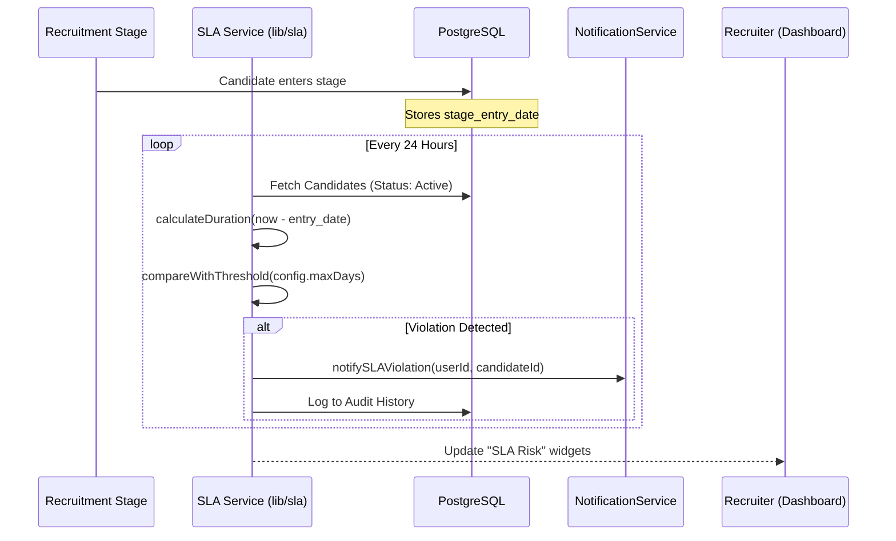

# FitScan SLA & Time-to-Hire Flow

FitScan monitors Service Level Agreements (SLAs) to ensure candidates move through the recruitment funnel efficiently and identify bottlenecks early.

---

## ⏱️ SLA Monitoring Lifecycle

---

## 🛠️ Key Metrics & Logic

### 1. Duration Tracking
The system tracks the exact time (in days) a candidate spends in their current `RecruitmentStage`.
- **In-Progress**: Candidates currently in a stage.
- **Completed**: The total time from "Applied" to "Hired" (Time-to-Hire).

### 2. SLA Status Levels
- **Healthy**: Duration < 50% of threshold.
- **Warning**: Duration between 50% and 100% of threshold.
- **Violated**: Duration exceeds the pre-configured maximum days for that specific stage.

### 3. Reporting (`SLAStatistics`)
Provides aggregate stats:
- **Average Time-to-Hire**: Across departments or recruiters.
- **Stage Bottleneck Analysis**: Identifying which stages (e.g., "Technical Review") consistently exceed SLAs.

---

## 📋 Configuration
Admins can define SLA thresholds per **Position** or **Recruitment Stage** in the **Settings** menu. 
- **Example**: "Technical Screen" should take max 3 days. "Offer Negotiation" should take max 5 days.
