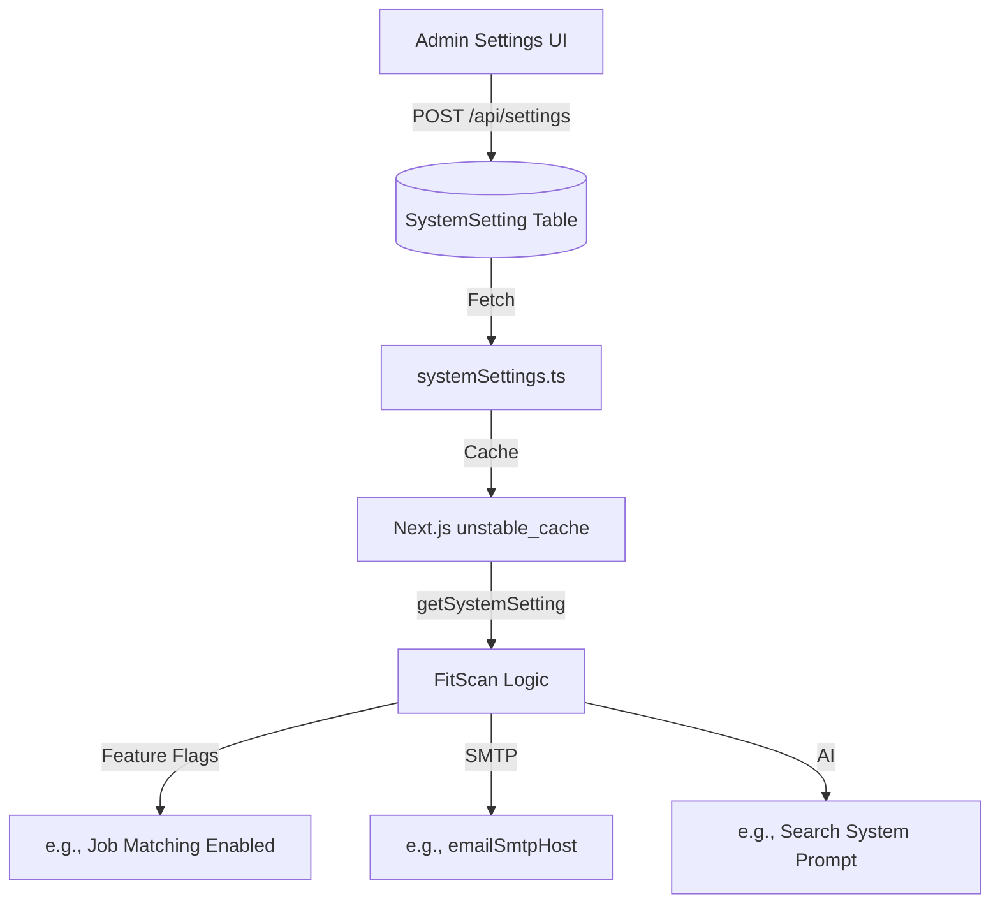

# FitScan System Configuration

FitScan uses a dynamic configuration layer that allows administrators to modify application behavior at runtime without environment variable changes or redeployments.

---

## ⚙️ Configuration Architecture

Settings are stored in the `SystemSetting` table and accessed via a high-performance caching layer.

---

## 🛠️ Key Implementation Details

### 1. The Caching Layer (`unstable_cache`)
To prevent a database query on every page load, the system uses Next.js `unstable_cache`:
- **Tags**: Uses the `system-settings` tag for on-demand revalidation.
- **TTL**: Fallback revalidation every 5 minutes.
- **Build-Time Protection**: Includes an `isBuildTime()` check to skip database connection attempts during `next build`, preventing build failures in CI/CD.

### 2. Fallback Mechanism
If the Next.js cache context is unavailable (e.g., in a background script or edge function), the service automatically falls back to a **direct database fetch** to ensure settings are always accessible.

---

## 📋 Critical Configuration Keys

| Key | Type | Description |
| :--- | :--- | :--- |
| `emailServiceEnabled` | `boolean` | Global toggle for SMTP notifications. |
| `jobMatchFeatureEnabled` | `boolean` | Controls visibility of AI matching scores. |
| `defaultMatchCriteria` | `string` | Base requirements for new positions. |
| `aiPowerSearchSystemPrompt` | `text` | The strict instructions sent to Gemini for searching. |
| `mfaRequired` | `boolean` | Forces all Recruiters to set up TOTP. |

---

## 🔄 Updating Configuration
When a setting is changed via the Admin panel:
1.  The database record is updated.
2.  The `revalidateTag(SYSTEM_SETTINGS_CACHE_TAG)` is called.
3.  All subsequent requests across all server nodes receive the fresh configuration immediately.
