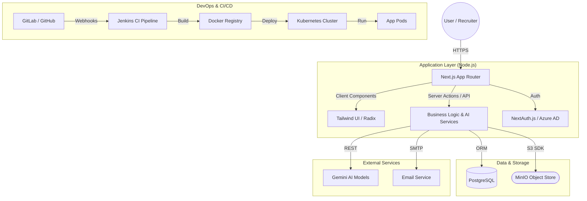
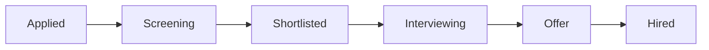
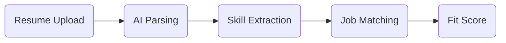
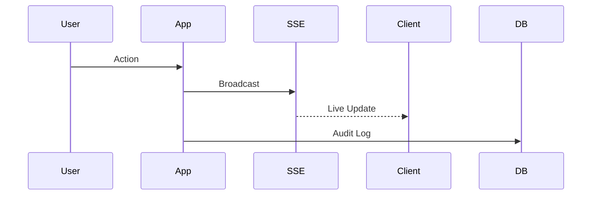

# System Architecture

**Project:** FitScan Enterprise
**Version:** 1.0
**Last Updated:** December 16, 2025
**Status:** Active
**Classification:** Internal

---

---

## 1. High-Level Architecture



---

## 2. Technology Stack

### 2.1 Frontend Technologies

| Component | Technology | Purpose |
|-----------|------------|---------|
| **Framework** | Next.js 15.5.2 (App Router) | Full-stack React framework with SSR/SSG |
| **UI Library** | React 18 | Component-based user interface |
| **Language** | TypeScript 5.0 | Type-safe development |
| **Styling** | Tailwind CSS | Utility-first CSS framework |
| **Components** | ShadCN UI | Pre-built accessible components |
| **Fonts** | Inter (English) + IBM Plex Sans Thai | Multi-language typography support |
| **Charts** | Chart.js + Recharts | Data visualization and analytics |

### 2.2 Backend Technologies

| Component | Technology | Purpose |
|-----------|------------|---------|
| **API Framework** | Next.js API Routes | RESTful API endpoints |
| **ORM** | Prisma 6.11.0 | Database abstraction and migrations |
| **Database** | PostgreSQL 15 | Primary data storage |
| **Authentication** | NextAuth.js | Multi-provider authentication |
| **File Storage** | MinIO | Object storage for files and media |
| **AI Integration** | Google Gemini API | Intelligent candidate matching and search |
| **Real-time** | Server-Sent Events (SSE) | Live updates and notifications |

### 2.3 DevOps & Infrastructure

| Component | Technology | Purpose |
|-----------|------------|---------|
| **Containerization** | Docker + Docker Compose | Application deployment |
| **Process Management** | PM2 | Production process management |
| **Monitoring** | Built-in health checks | System monitoring and alerts |
| **Observability** | Structured logging + PostgreSQL | Unified logs and audit trails |
| **Logging** | Structured logging | Audit trails and debugging |
| **Testing** | Vitest + Testing Library | Unit and integration testing |
| **Automation** | N8N | Workflow automation platform |

---

## 3. Core Business Processes

### 3.1 Candidate Lifecycle Management



### 3.2 AI-Powered Matching Workflow



### 3.3 Real-time Collaboration



---

## 4. Database Schema Overview

The database is organized into the following logical domains:

### 4.1 User Management
- `User` - Core user accounts
- `UserGroup` - Permission groups
- `UserTeam` - Team organization
- `Permission` - Granular permissions
- `UserPreference` - User-specific settings

### 4.2 Candidate Management
- `Candidate` - Applicant profiles
- `Attachment` - Resume and document storage
- `TransitionRecord` - Stage change history
- `CandidateComment` - Notes and feedback
- `CandidateEvaluation` - Interview scores
- `CandidateEvaluationLink` - Shareable evaluation URLs

### 4.3 Position Management
- `Position` - Job requisitions
- `Grade` - Job levels/grades
- `PositionLevel` - Seniority levels
- `Headcount` - Hiring quotas
- `PositionInterviewer` - Assigned interviewers
- `PositionExpertiseSkill` - Required skills
- `PositionPersonalityTrait` - Desired traits

### 4.4 Workflow Management
- `RecruitmentStage` - Pipeline stages
- `CustomField` - Dynamic field definitions
- `Webhook` - External integrations
- `UploadQueue` - File processing queue

### 4.5 Analytics & Logging
- `AuditLog` - System activity tracking
- `LogEntry` - Application logs
- `Notification` - User notifications
- `Dashboard` - Analytics configurations
- `DashboardShare` - Shared dashboard access

### 4.6 System Configuration
- `SystemSetting` - Application settings
- `SystemPreference` - Server-side preferences
- `SystemPrompt` - AI prompt templates
- `WarningConfiguration` - Data quality rules

### 4.7 Evaluation Templates
- `ExpertiseSkillTemplate` - Skill definitions
- `PersonalityTraitTemplate` - Trait definitions
- `ExpertiseGroup` - Skill categories
- `PersonalityGroup` - Trait categories

---

## 5. Project Structure

```
studio-2/
├── src/
│   ├── app/                    # Next.js App Router pages and API routes
│   │   ├── api/               # API endpoints
│   │   │   ├── v1/            # V1 API (stable)
│   │   │   ├── candidates/    # Candidate endpoints
│   │   │   ├── positions/     # Position endpoints
│   │   │   ├── ai/            # AI endpoints
│   │   │   ├── settings/      # Settings endpoints
│   │   │   └── ...
│   │   ├── candidates/        # Candidate pages
│   │   ├── positions/         # Position pages
│   │   ├── settings/           # Settings pages
│   │   └── ...
│   ├── components/            # React components
│   │   ├── ui/                # UI components (ShadCN)
│   │   ├── candidates/        # Candidate-related components
│   │   ├── positions/          # Position-related components
│   │   ├── settings/           # Settings components
│   │   └── ...
│   ├── lib/                    # Utility libraries
│   │   ├── prisma.ts          # Prisma client
│   │   ├── minio.ts           # MinIO client
│   │   ├── realtime.ts        # SSE real-time hub
│   │   └── ...
│   ├── hooks/                  # React hooks
│   ├── contexts/              # React contexts
│   ├── types/                  # TypeScript types
│   └── middleware.ts          # Next.js middleware
├── prisma/
│   ├── schema.prisma          # Database schema
│   ├── migrations/            # Database migrations
│   └── seed.ts                # Database seed script (See [Migration Guide](../infrastructure/Migration Guide.md))
├── scripts/                   # Utility scripts
├── docs/                       # Documentation
├── public/                     # Static assets
└── docker-compose.yml          # Docker configuration
```

---

## 6. Integration Points

### 6.1 External Services
- **Azure AD** - Single Sign-On authentication
- **Google AI (Genkit)** - Candidate matching and resume parsing
- **MinIO** - S3-compatible object storage
- **N8N** - Workflow automation

### 6.2 Webhook Events
The system emits the following events to configured webhook endpoints:
- `candidate.created` - New candidate added
- `stage.changed` - Candidate moved to new stage
- `score.updated` - Evaluation score modified

### 6.3 Real-time Channels (SSE)
- `evaluation-updates` - Live score synchronization
- `upload-queue` - Background processing status
- `notifications` - User notifications

---

## 7. Port Configuration

| Service | Internal Port | External Port | Description |
|---------|---------------|---------------|-------------|
| **Main App** | 8021 | 8021 | Next.js application |
| **MinIO API** | 9000 | 9847 | Object storage API |
| **MinIO Console** | 9001 | 9848 | Storage management UI |
| **PostgreSQL** | 8521 | 5432 | Database |
| **N8N** | 5678 | 8921 | Workflow automation |

---

## 8. Related Documentation

- [Installation Guide](../infrastructure/Installation Guide.md) - Setup and deployment
- [API Specification](../development/API Specification.md) - REST API reference
- [Authentication Flow](../workflows/Authentication Flow.md) - Identity and access
- [Job Matching Flow](../workflows/Job Matching Flow.md) - AI scoring logic
- [Security](./SECURITY.md) - Security implementation
