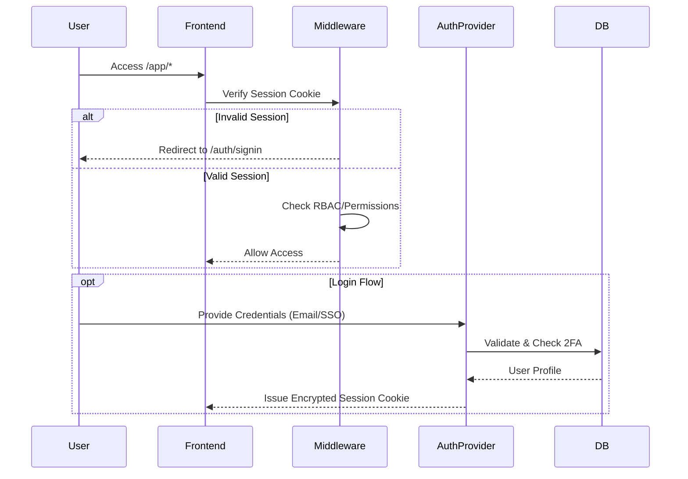

# Security Architecture

**Version:** 1.1
**Last Updated:** January 26, 2026
**Status:** Active
**Classification:** Internal

---

## 1. Introduction
This document outlines the comprehensive security architecture for HRI Enterprise, covering authentication, authorization, data protection, and infrastructure security.

## 2. Authentication Architecture
The system employs a dual-authentication strategy supporting both local credentials and Enterprise SSO.



### 2.1 Credential Security
- **Hashing**: `bcrypt` with dynamic salt rounds (Default: 10).
- **Policies**: 
  - Minimum 8 characters.
  - Forced password reset on first login (`forcePasswordChange`).
  - Account lockout after 5 failed attempts (`lockedUntil`).

### 2.2 Enterprise SSO
- **Protocol**: OpenID Connect (OIDC).
- **Provider**: Azure Active Directory.
- **Mapping**: Matches `User.email` to Azure AD UPN.

---

## 3. Data Protection

### 3.1 Data at Rest
- **Database**: PostgreSQL disk-level encryption (managed via cloud provider).
- **Secrets**: API Keys and Tokens stored in environment variables, never committed to code.
- **Sensitive Fields**: 
  - `twoFactorSecret` is encrypted at the application level.
  - `access_token` in `Account` table is protected.

### 3.2 Data in Transit
- **TLS 1.2+**: Enforced for all inbound HTTP traffic.
- **HSTS**: `Strict-Transport-Security` header max-age set to 1 year.
- **Secure Cookies**: `HttpOnly`, `Secure`, and `SameSite=Lax` attributes enforced.

### 3.3 File Security
- **Storage**: MinIO (S3 Compatible).
- **Access Control**: Public bucket access is **Disabled**.
- **Delivery**: All files served via time-limited Presigned URLs (30-60 mins).
- **Upload Validation**: Mime-type checking (`application/pdf`, `image/*`) and magic-byte verification.

---

## 4. Access Control (RBAC)

### 4.1 Role Hierarchy
The system implements a hierarchical role model:

| Role | Scope | Permissions |
|:---|:---|:---|
| **Super Admin** | System | `*` (Full Access) |
| **Admin** | System | User Management, Settings, Logs |
| **Recruiter** | Operational | Create Jobs, Manage applicants (Own) |
| **Hiring Manager** | Operational | View applicants, Approve Jobs |
| **Interviewer** | Session | Score Assigned applicants Only |

### 4.2 Ownership Logic
Permissions are refined by ownership rules found in `src/lib/permissions.ts`:
- **Global**: `applicantS_EDIT_ALL` (Can edit any applicant).
- **Scoped**: `applicantS_EDIT_OWN` (Can only edit applicants where `recruiterId === currentUser.id`).

---

## 5. Infrastructure Security

### 5.1 Content Security Policy (CSP)
Strict CSP headers are injected via `next.config.js` to mitigate XSS:
- **Scripts**: `self`, `unsafe-inline` (Next.js requirement), `fonts.googleapis.com`.
- **Images**: `self`, `localhost`, `placehold.co`.
- **Frames**: `DENY` (prevents Clickjacking).

### 5.2 Rate Limiting
Implemented via Token Bucket algorithm in `middleware.ts`:
- **Auth Routes**: 10 req/min (Strict).
- **API Routes**: 100 req/min (Standard).
- **Public**: 60 req/min.

---

## 6. Audit & Monitoring

### 6.1 Audit Logging
Every write operation triggers a `UserActivityLog` entry:
- **Actor**: User ID and IP Address.
- **Action**: Event Type (e.g., `applicant_UPDATE`).
- **Diff**: JSON delta of changed fields.

### 6.2 Monitoring Dashboard
- **Security Events**: Failed logins, lockout triggers.
- **Performance**: API latency and error rates.
- **Integrations**: N8N webhook failure rates.

---

## 7. References
- [Architecture Overview](./Architecture.md)
- [System Requirements](../requirements/Software Requirements Specification.md)

**Project Name:** HRI Enterprise  
**Document Version:** 1.0  
**Date:** December 16, 2025  
**Status:** Active Development

---

## 1. Authentication & Authorization

### 1.1 Password Security

- **Password Hashing**: bcrypt with salt rounds (configurable)
- **Session Management**: Secure NextAuth.js sessions with JWT
- **Force Password Change**: Require password changes on first login
- **Account Lockout**: Inactive account management

### 1.2 Multi-Provider Authentication

- **Email/Password**: Traditional login with bcrypt hashing
- **Azure AD SSO**: Enterprise single sign-on
- **Session Refresh**: Automatic session refresh and validation

---

## 2. Data Protection

### 2.1 Input Validation

- **Schema Validation**: Zod schema validation on all inputs
- **SQL Injection Prevention**: Parameterized queries via Prisma ORM
- **XSS Protection**: Content Security Policy headers and sanitization

### 2.2 File Security

- **Type Validation**: Strict file type checking
- **Size Limits**: Configurable upload size limits
- **Secure Access**: MinIO with signed URLs for file access
- **Virus Scanning**: Optional virus scanning integration

### 2.3 Data Encryption

- **At Rest**: Database encryption for sensitive data
- **In Transit**: TLS 1.2+ for all communications
- **Secrets**: Environment variable storage for sensitive configuration

---

## 3. Access Control

### 3.1 Role-Based Access Control (RBAC)

| Role | Description | Access Level |
|------|-------------|--------------|
| **Super Admin** | Full system access | All modules and settings |
| **Admin** | Administrative access | User management, system settings |
| **Recruiter** | Recruitment operations | applicants, positions (Read/Write) |
| **Hiring Manager** | Decision making | Assigned positions, applicants (Read) |
| **Interviewer** | Evaluation only | Assigned evaluation sessions |

### 3.2 Granular Permissions

Permissions are organized by module:
- `VIEW` - Read access to module data
- `MANAGE` - Create, update, delete operations
- `EXPORT` - Export data to CSV/Excel
- `IMPORT` - Import data from external sources
- `ADMIN` - Administrative functions

### 3.3 Permission Hierarchy

1. **User Groups**: Define base permissions
2. **User Assignment**: Users inherit group permissions
3. **Individual Overrides**: User-specific permission customization

### 3.4 API Authentication

- **Session-based**: Web application authentication
- **JWT Tokens**: V1 API authentication
- **API Keys**: External service integration

---

## 4. Security Monitoring

### 4.1 Audit Logging

All critical operations are logged:
- User authentication events
- Data modifications (create, update, delete)
- Permission changes
- System configuration changes

### 4.2 Security Dashboard

- Monitor security alerts
- Track access patterns
- Identify suspicious activity
- Review authentication failures

### 4.3 Session Monitoring

- Track active user sessions
- Monitor concurrent logins
- Detect session anomalies
- Force session termination

### 4.4 Content Protection Features

**Screen Capture Protection** (configurable via System Settings):
- Blurs page content when browser tab loses focus
- Blocks PrintScreen key capture
- Blocks Windows Snipping Tool shortcut (Win+Shift+S)
- Prevents screen recording of sensitive data

**Right-Click Protection** (configurable via System Settings):
- Disables browser context menu across the application
- Prevents "Save Image As" and "Inspect Element" access
- Configurable per deployment via System Settings UI

> **Configuration**: Navigate to Settings → System Settings → Security to enable/disable these features.

---

## 5. Best Practices Implementation

### 5.1 Environment Variables

All sensitive configuration stored in environment variables:
- Database credentials
- API keys
- Authentication secrets
- External service tokens

### 5.2 Secrets Management

- Secure storage of application secrets
- Regular rotation of credentials
- Separation of development/production secrets

### 5.3 HTTPS Enforcement

- SSL/TLS for production deployments
- Certificate management
- HSTS headers

### 5.4 CORS Configuration

- Whitelist allowed origins
- Restrict HTTP methods
- Control credential sharing

### 5.5 Rate Limiting

- API endpoint rate limiting
- Brute force protection
- DDoS mitigation

### 5.6 Security Headers

```
X-Content-Type-Options: nosniff
X-Frame-Options: DENY
X-XSS-Protection: 1; mode=block
Content-Security-Policy: ...
Strict-Transport-Security: ...
```

---

## 6. Compliance

### 6.1 Data Retention

- Soft-delete implementation for auditability
- Configurable retention periods
- Data purge procedures

### 6.2 Privacy Considerations

- PII data handling guidelines
- Data minimization practices
- User consent management

### 6.3 Audit Trail

- Complete activity logging
- Immutable audit records
- Log retention policies

---

## 7. Incident Response

### 7.1 Detection

- Monitor security alerts
- Review audit logs
- Track anomalous behavior

### 7.2 Response Procedures

1. Identify the security incident
2. Contain the threat
3. Investigate root cause
4. Remediate vulnerabilities
5. Document and learn

### 7.3 Recovery

- Backup restoration procedures
- System integrity verification
- Security patch application

---

## 8. Security Checklist

### 8.1 Deployment

- [ ] Change default admin password
- [ ] Configure HTTPS/SSL
- [ ] Set secure NEXTAUTH_SECRET
- [ ] Configure CORS properly
- [ ] Enable audit logging
- [ ] Review file permissions

### 8.2 Regular Maintenance

- [ ] Review audit logs weekly
- [ ] Update dependencies monthly
- [ ] Rotate secrets quarterly
- [ ] Security assessment annually

---

## 9. Related Documentation

- [Installation Guide](./Installation Guide.md) - Secure deployment
- [CLI Reference](./CLI Reference.md) - CLI security considerations
- [Backup & Recovery](./Backup & Recovery.md) - Data protection
