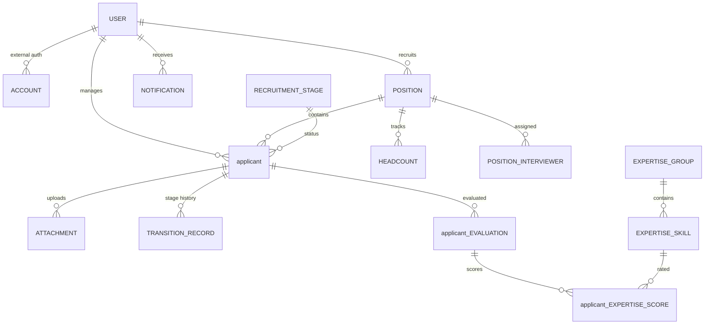

# FitScan Database Design

**Project:** FitScan Enterprise
**Version:** 1.0
**Last Updated:** December 16, 2025
**Status:** Active
**Classification:** Internal

## 1. Entity Relationship Overview

The schema is organized into several functional modules:

---

## 2. User & Access Control
Manages identity, authentication (Basic + Azure AD), and role-based permissions.

- **`User`**: Central identity table. Stores profile info, role, and MFA state.
- **`UserGroup`**: Defines sets of permissions for RBAC.
- **`UserTeam`**: Groups users for organizational structure.
- **`Account`**: External OAuth provider links (managed by NextAuth).
- **`UserActivityLog`**: Tracks security events (logins, password changes).

---

## 3. Recruitment Core
The heart of the system, tracking job openings and applicants.

- **`Position`**: Job requisition details, required skills, and assigned recruiters.
- **`applicant`**: Applicant profiles, contact info, parsed resume data, and AI Fit Scores.
- **`RecruitmentStage`**: Configurable workflow stages (e.g., "Screening", "Technical Interview").
- **`TransitionRecord`**: Audit trail of every time a applicant moves between stages.
- **`applicantSource`**: Tracks where applicants came from (LinkedIn, Referral, etc.).

---

## 4. Evaluation & AI Matching
A sophisticated subsystem for assessing applicants against position requirements.

- **`ExpertiseSkill` & `PersonalityTrait`**: Atomic units of evaluation, grouped into `ExpertiseGroup` and `PersonalityGroup`.
- **`SkillTemplate`**: Predefined sets of skills/traits that can be quickly applied to new positions.
- **`applicantEvaluation`**: A specific assessment session for a applicant, including scores and comments.
- **`JobMatch`**: Stores AI-generated justifications and scores for applicant-position matching.

---

## 5. System & Integration
Utility tables for extensibility and monitoring.

- **`CustomFieldDefinition`**: Allows users to add dynamic fields to applicants or Positions without schema changes (JSONB backed).
- **`Webhook`**: Configures outbound event notifications (e.g., notify Slack when a applicant is hired).
- **`UploadQueue`**: Manages asynchronous processing of uploaded resumes.
- **`AuditLog` & `LogEntry`**: General system logging and security auditing.

---

## 6. Dashboards & UI
Stores user-specific interface configurations.

- **`Dashboard`**: Custom layouts for analytics.
- **`UserUIDisplayPreference`**: Remembers UI states (filters, column visibility) per user.
- **`Notification`**: In-app alerts for recruiters.

---

## 7. Key Design Patterns
1. **Soft Deletions/Active Flags**: Most entities use `isActive` booleans instead of hard deletes to maintain audit integrity.
2. **JSONB for Extensibility**: Tables like `applicant` and `Position` use JSONB columns (`parsedData`, `customAttributes`) for flexible data structures.
3. **Audit Trails**: Every stage movement is captured in `TransitionRecord`, and every security action in `UserActivityLog`.
