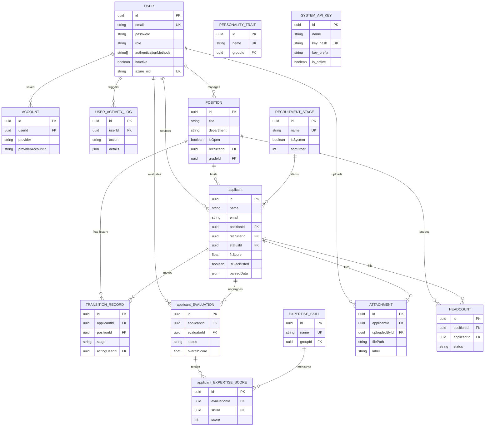

# Entity Relationship Diagram (ERD)

**Project:** FitScan Enterprise
**Version:** 3.0
**Last Updated:** December 16, 2025
**Status:** Active
**Classification:** Internal

---

## 1. Introduction
This document provides a comprehensive detailing of the data model for FitScan. It covers all database entities defined in the Prisma schema, categorized by their functional domain.
    

## 2. Domain: User Management & Authentication
*Core entities for identity, access control, and organizational structure.*

### 2.1 User
*   **Description**: The central identity combining profile, authentication, and access data.
*   **Key Fields**:
    *   `id` (UUID): Primary Key.
    *   `email`, `name`: Basic profile.
    *   `role`: High-level role (Admin, Recruiter, Hiring Manager).
    *   `authenticationMethod`: 'basic' or 'azure_ad'.
    *   `azure_oid`: Azure Object ID for SSO mapping.
    *   `module_permissions`: Array of specific access rights (e.g., `["applicant_VIEW", "POSITION_EDIT"]`).
    *   `userGroupId`, `userTeamId`: FKs to Group/Team.

### 2.2 UserGroup
*   **Description**: Defines a set of permissions reusable across users (e.g., "Senior Recruiter").
*   **Key Fields**: `name`, `permissions` (String[]), `isSystemRole` (Boolean).

### 2.3 UserTeam
*   **Description**: Represents an organizational unit (e.g., "Engineering Team", "Sales Team").
*   **Key Fields**: `name`, `color`, `isActive`.

### 2.4 Account
*   **Description**: NextAuth.js linking table for OAuth providers.
*   **Key Fields**: `provider` (e.g., "azure-ad"), `providerAccountId`, `access_token`.

### 2.5 UserUIDisplayPreference
*   **Description**: Stores user-specific UI settings (e.g., which columns to show in a table).
*   **Key Fields**: `modelType`, `attributeKey`, `uiPreference`.

## 3. Domain: applicant Management
*Entities managing the applicant lifecycle, resumes, and history.*

### 3.1 applicant
*   **Description**: The primary entity representing an applicant.
*   **Key Fields**:
    *   `fitScore` (Float): AI-calculated match score (0-100).
    *   `parsedData` (Json): Structured data extracted from resume (Skills, Edu, Exp).
    *   `customAttributes` (Json): Dynamic fields defined by admin.
    *   `statusId`: FK to `RecruitmentStage`.
    *   `sourceId`: FK to `applicantSource`.

### 3.2 RecruitmentStage
*   **Description**: Steps in the hiring pipeline (e.g., "Screening", "Offer").
*   **Key Fields**: `name`, `sortOrder`, `isSystem` (cannot be deleted if true).

### 3.3 applicantSource
*   **Description**: Origin of the applicant (e.g., "LinkedIn", "Referral").
*   **Key Fields**: `name`, `allowSubSource` (Boolean).

### 3.4 Attachment
*   **Description**: Files associated with entities (Resumes, Cover Letters).
*   **Key Fields**: `filePath` (MinIO path), `fileName`, `isPrimary` (Main resume flag).

### 3.5 TransitionRecord
*   **Description**: Audit log of stage movements.
*   **Key Fields**: `fromStage`, `toStage`, `actingUserId`, `date`.

### 3.6 applicantComment
*   **Description**: Rich text notes added by users.
*   **Key Fields**: `content`, `authorId`, `attachmentIds` (File associations).

## 4. Domain: Position Management
*Entities managing job requisitions and planning.*

### 4.1 Position
*   **Description**: A Job Opening or Requisition.
*   **Key Fields**:
    *   `title`, `department`, `description`.
    *   `isOpen` (Boolean): Status of the requisition.
    *   `headcount`: Calculated aggregation of Headcount entities.

### 4.2 Headcount
*   **Description**: A specific "seat" or approved hire slot within a position.
*   **Key Fields**:
    *   `status`: 'vacant', 'offered', 'filled'.
    *   `applicantId`: The applicant filling this slot (if filled).

### 4.3 PositionInterviewer
*   **Description**: Junction table assigning Users to interview for a Position.
*   **Key Fields**: `positionId`, `userId`.

## 5. Domain: Evaluation & Scoring
*Entities for the interview feedback process.*

### 5.1 applicantEvaluation
*   **Description**: A container for a single interview session's feedback.
*   **Key Fields**: `overallScore`, `status` (in_progress/completed), `evaluatorId`.

### 5.2 ExpertiseSkill & PersonalityTrait
*   **Description**: Master data for criteria.
*   **Key Fields**: `name`, `description`, `maxScore`.

### 5.3 applicantExpertiseScore & applicantPersonalityScore
*   **Description**: Individual score points within an evaluation.
*   **Key Fields**: `score` (Int), `notes` (String).

### 5.4 PositionExpertiseSkill & PositionPersonalityTrait
*   **Description**: Configures *which* skills/traits are required for a specific Position.
*   **Key Fields**: `isRequired`, `weight` (Importance factor).

## 6. Domain: System & Automation
*Entities for background processing and configuration.*

### 6.1 UploadQueue
*   **Description**: Tracks background jobs (Resume Parsing, Bulk Import).
*   **Key Fields**: `status` (pending/processing/completed/failed), `filePath`, `errorDetails`.

### 6.2 Webhook
*   **Description**: Configuration for outbound event notifications.
*   **Key Fields**: `url`, `events` (Array of triggers), `isActive`.

### 6.3 WebhookLog
*   **Description**: History of webhook delivery attempts.
*   **Key Fields**: `payload`, `response_status`, `success`.

### 6.4 Notification
*   **Description**: In-app user notifications.
*   **Key Fields**: `type`, `message`, `isRead`.

### 6.5 SystemSetting
*   **Description**: Global application configuration.
*   **Key Fields**: `key` (String ID), `value` (String).

### 6.6 AuditLog
*   **Description**: Security and compliance trail.
*   **Key Fields**: `action`, `entity`, `entity_id`, `actingUserId`, `details` (Json).

## 7. Domain: Dashboard & Analytics
*Entities for reporting.*

### 7.1 Dashboard
*   **Description**: Custom dashboard configuration for a user.
*   **Key Fields**: `layout` (grid/list), `widgets` (Json config).

### 7.2 DashboardWidget
*   **Description**: Individual chart/metric configuration.
*   **Key Fields**: `type` (funnel/bar/metric), `dataSource`, `config`.
