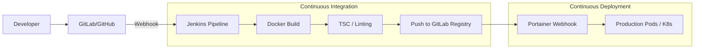

# Deployment & CI/CD Flow

**Project:** HRI Enterprise
**Version:** 1.0
**Last Updated:** December 16, 2025
**Status:** Active
**Classification:** Internal

---

## 1. The Pipeline Lifecycle

The automation is driven by **Jenkins** and **Docker**, following a "Build Once, Deploy Anywhere" philosophy.

---

## 2. Pipeline Stages (`Jenkinsfile`)

### 1. Build & Containerization
- **Multi-stage Build**: Uses a lightweight Node image for production, stripping out development dependencies.
- **Tagging Strategy**: Uses the short Git commit hash as the unique image tag (e.g., `hri:a1b2c3d`) and updates the `latest` tag on successful builds.

### 2. Registry Management
Images are pushed to a private registry:
- **Endpoint**: Configure your own container registry endpoint.
- **Security**: Authenticated via Jenkins `Credentials ID`.

### 3. Automated Deployment
The pipeline supports two primary deployment methods:
- **Portainer Webhook**: Triggers an instant update to a running stack.
- **SSH + Docker Compose**: (Fallback) Remote execution of `docker compose pull && docker compose up -d`.

---

## 3. Infrastructure Stack

### 1. Docker
- Every component (Next.js, PostgreSQL, MinIO) is containerized.
- Environment variables are managed via Docker Secrets or ConfigMaps.

### 2. Kubernetes (Production)
In high-availability environments, the app is deployed to **Kubernetes**:
- **Manifests**: Located in `/k8s`.
- **Ingress**: Handles SSL termination and routing via Nginx.
- **StatefulSets**: Used for the PostgreSQL database to ensure data persistence.

### 3. Portainer
Provides a visual interface for managing containers, reviewing logs, and monitoring resource usage across different environments (Dev, Staging, Production).

---

## 4. Environment Secrets
Critical secrets are **never** stored in Git:
- `DATABASE_URL`
- `NEXTAUTH_SECRET`
- `AZURE_AD_CLIENT_SECRET`
- `MINIO_SECRET_KEY`
- `GEMINI_API_KEY`
These are injected at runtime by the container orchestrator.
