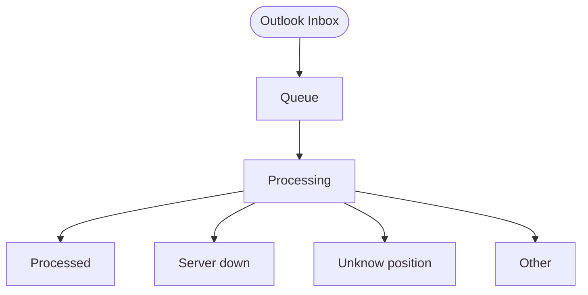

# N8N Workflow Automation

**Project:** FitScan Enterprise
**Version:** 1.0
**Last Updated:** December 16, 2025
**Status:** Active
**Classification:** Internal

---

## 1. Overview

FitScan includes N8N for powerful workflow automation capabilities. N8N allows you to create automated workflows that integrate with your recruitment processes.

---

## 2. Features

- **Visual Workflow Builder**: Drag-and-drop interface
- **Integration Hub**: Connect with 200+ services
- **Webhook Support**: Trigger workflows via HTTP
- **Database Integration**: Direct connection to PostgreSQL
- **Custom Nodes**: Extend functionality
- **Scheduling**: Time-based workflow execution
- **Error Handling**: Robust retry mechanisms

---

## 3. Default Configuration

| Setting | Value |
|---------|-------|
| **URL** | http://localhost:8921 |
| **Username** | admin |
| **Password** | admin |
| **Database** | Same PostgreSQL instance |

---

## 4. Environment Variables

```env
N8N_PORT=8921
N8N_DB_NAME=n8n
N8N_BASIC_AUTH_ACTIVE=true
N8N_BASIC_AUTH_USER=admin
N8N_BASIC_AUTH_PASSWORD=admin
N8N_HOST=localhost
N8N_PROTOCOL=http
N8N_ENCRYPTION_KEY=your-encryption-key-here
N8N_WEBHOOK_URL=http://localhost:8921/
N8N_TIMEZONE=Asia/Bangkok
N8N_ENFORCE_SETTINGS_FILE_PERMISSIONS=true
N8N_DB_CONNECTION_TIMEOUT=60000
```

---

## 5. Use Cases

- **Email Notifications**: Send emails when applicants move stages
- **CRM Integration**: Sync applicant data with external CRM
- **Resume Processing**: Automate resume parsing
- **Interview Scheduling**: Integrate with calendar systems
- **Background Checks**: Automate background check processes
- **Reporting**: Generate and send automated reports

---

## 6. Security Notes

**Important**:
- Change the default admin password immediately
- Update `N8N_ENCRYPTION_KEY` with a strong, unique key
- Enable HTTPS in production
- Review webhook security settings

---

## 7. Related Docs
- [Installation](./INSTALLATION.md)
- [Architecture](./ARCHITECTURE.md)
- [API Overview](./API_OVERVIEW.md)

---

## 8. Technical Deep Dive: Bi-Directional Communication

### App to n8n (Outgoing Webhooks)
FitScan uses a built-in **Webhook Dispatcher** to notify n8n of specific events.

- **Mechanism**: When an event occurs (e.g., a applicant is created), the `WebhookDispatcher` sends a POST request with a JSON payload to a pre-configured URL (your n8n Webhook Node).
- **Supported Events**:
  - `applicant.created`, `applicant.updated`, `applicant.stage_changed`
  - `position.created`, `position.deleted`
  - `resume.uploaded`, `resume.processed`
  - `upload_queue.completed`, `upload_queue.failed`
- **Security**: Supports Basic Auth, Bearer tokens, or custom headers to ensure only authorized requests are accepted by n8n.

### n8n to App (REST API V2)
n8n can perform actions in FitScan (like updating a applicant's status or fetching report data) using the **V2 API**.

- **Authentication**: n8n uses **System API Keys** for secure access.
- **n8n Compatibility**: The `/api/v2/auth/login` endpoint specifically supports the `Authorization: Bearer <sk_live_...>` header format, which is the standard for n8n's "Header Auth" or "HTTP Request" nodes.
- **Workflow**:
  1. n8n sends the API Key to `/api/v2/auth/login`.
  2. The app validates the key and returns a JWT token.
  3. n8n uses this token for subsequent API calls (e.g., `GET /api/v2/applicants`).

---

## 9. Workflow-Specific Requirements

### 9.1 Outlook Folder Structure (Inbound Processing)
The `FitScan [Inbound applicant].json` workflow manages applicant emails. Create the following hierarchy in your monitoring Outlook account:



- **Queue**: Initial landing folder for incoming resumes.
- **Processing**: Intermediate state while the workflow is running.
- **Processed**: Destination for successfully uploaded applicants.
- **Server down**: Failover destination if the FitScan API is unreachable.
- **Unknow position**: Destination for emails where the AI cannot determine the target job position.
- **Other**: Catch-all for non-applicant or irrelevant communications.

### 9.2 Windmill Integration (HTML-to-PDF)
For high-fidelity parsing of HTML-based resumes, the system utilizes a **Windmill** worker:
- **Endpoint**: `https://ncc-windmill.qsncc.com/api/w/analyst-hub/jobs/run_wait_result/p/f/windmill/fitscan_convert_html_pdf`
- **Method**: `POST`
- **Mechanism**: POSTs raw HTML content to Windmill; receives a binary PDF in response.
- **Credential**: Requires a "Header Auth" credential in n8n for the Windmill API Bearer token.

---

**Version:** 1.1 | **Last Updated:** January 26, 2026

