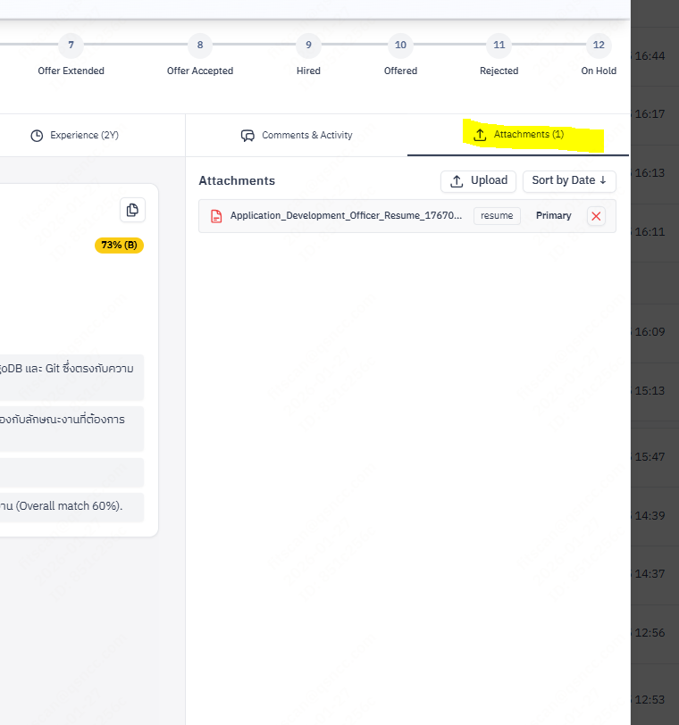
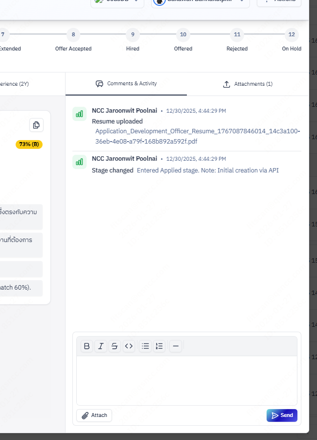
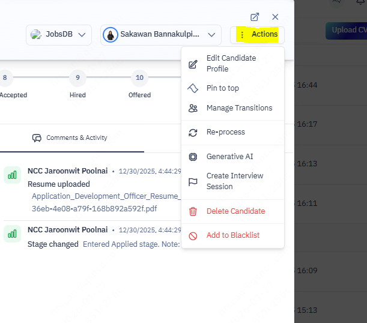

# applicant Profile Management
**Role:** Recruiter, Hiring Manager (View Only)

## The Command Center for applicant Data
The **applicant Profile** (or "Detail Modal") is the single source of truth for every applicant. It opens whenever you click on a applicant's name from any list.

## 1. Anatomy of the Profile Modal
| Column | Content | Purpose |
| :--- | :--- | :--- |
| **Top: Pipeline** | Stage Progress Bar | Visualizes current status and recommended next steps. |
| **Main: Tabs** | applicant Info, Education, Experience, Job Applied. | Deep dive into resume data and application context. |
| **Right: Sidebar** | Activity Log, Comments, Files. | The "Audit Trail" of collaboration and documents. |

## 2. The Main Tabs
Detailed breakdown of the applicant's data.

### 2.1 Jobs Applied & Matched
*   **Job Applied**: Shows the primary position they applied for, with the AI Fit Score.
*   **Job Matches**: (If enabled) Shows other open positions the applicant is a good fit for.

### 2.2 applicant Info
Parsed personal details (Phone, Email, Location) and custom fields.

### 2.3 Education & Experience
Parsed timeline of work history and degrees. Useful for verifying "Years of Experience".

## 2. The Evaluation Tab (Right Column)
This panel drives the decision-making process.

### 2.1 AI Deep Dive
*   **Fit Score**: Click the percentage badge to see *why* the AI gave that score. It lists:
    *   **Matched Skills**: Keywords found in both Resume and JD.
    *   **Missing Skills**: Critical gaps (red text).
    *   **Experience Match**: Years of experience vs requirement.

### 2.2 Scorecards
View feedback from all interviewers in one place.
*   **Summary**: expanding the row shows the average star rating (1-5).
*   **Details**: Click to read specific "Strengths" and "Red Flags" noted by the hiring manager.
*   **Status**:
    *   `Pending`: Interview scheduled but feedback not submitted.
    *   `Submitted`: Scorecard is complete.

## 3. Attachment Management
Manage resumes, portfolios, and cover letters.
*   **View**: Click the **"Eye"** icon on any file to preview it in-browser without downloading.
*   **Add**: Click **"Upload New Version"** to replace or append files.
*   **Download**: Click the **"Down Arrow"** to save to your local machine.
*   

## 3. Comments & Activity Log
Collaborate with your team without leaving the app.
*   **Internal Notes**: Type in the box at the bottom center. Use `@mention` (future feature) to notify colleagues.
    *   *Example: "Spoke to applicant, they are available to start in March."*
*   **System Activity**: The system automatically logs:
    *   Stage changes (e.g., Screening → Interview).
    *   Email emails sent/received.
    *   Interview scheduled events.
   

## 4. Action Buttons (Top Right)
Primary actions are grouped under the **"Actions"** dropdown menu (vertical dots icon):

| Action | Description |
| :--- | :--- |
| **Edit applicant Profile** | Modify name, email, or custom fields. |
| **Manage Transitions** | Move applicant to a new stage (e.g., *Screening* → *Interview*). |
| **Re-process** | Re-run the resume parser (useful if initial parse failed). |
| **Generative AI** | Generate a applicant summary or email draft. |
| **Create Interview Session** | Generate a scorecard link for interviewers. |
| **Delete applicant** | Permanently remove the record. |

*   **Quick Actions**:
    *   **Pin**: Pin applicant to the top of the list.
    *   **Blacklist**: Block applicant from future applications.

## 5. Skills Actions
Manually refine the AI's analysis.
*   **Evaluate Skill**: Click on a skill tag (e.g., "Python") to give it a manual rating (Beginner/Intermediate/Expert). This overrides the AI's confidence score.
*   **Assign Skill**: Click **"+ Add Skill"** to manually tag a applicant with a qualification the parser missed (e.g., "Leadership").
*   **Delete Skill**: Click the **"X"** on a tag to remove irrelevant skills.

## 5. Visual Indicators
*   **Urgency Tags**: Look for red tags like **"Overdue"** or **"No Action (7 Days)"** which indicate a stalled pipeline.
*   **Fit Score Badge**:
    *   🟢 **Green (85%+)**: Strong match.
    *   🟡 **Yellow (60-84%)**: Moderate match.
    *   🔴 **Red (<60%)**: Weak match.
