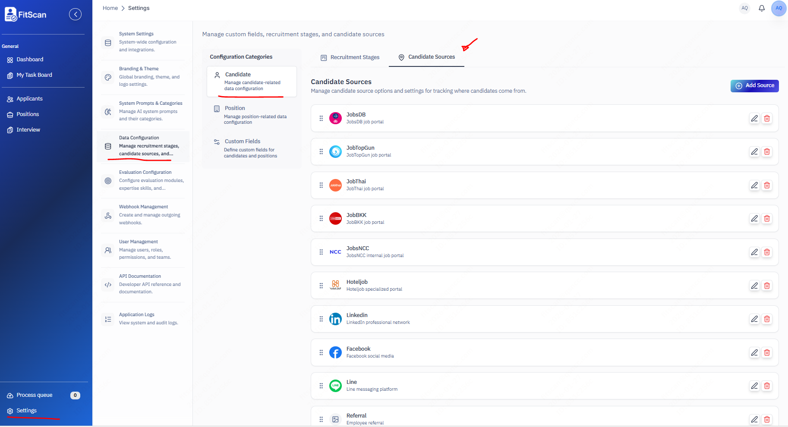
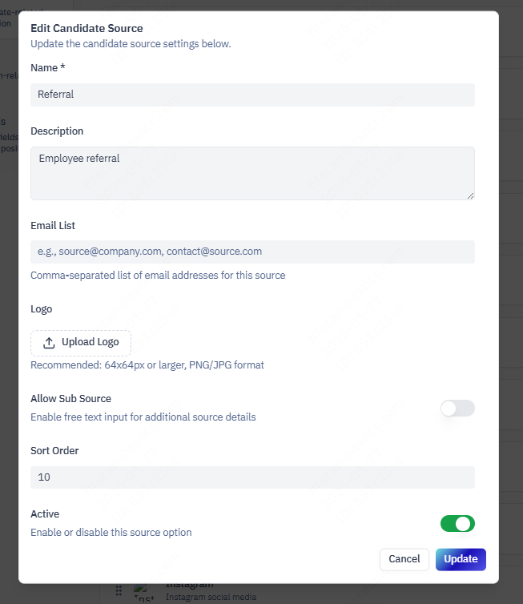
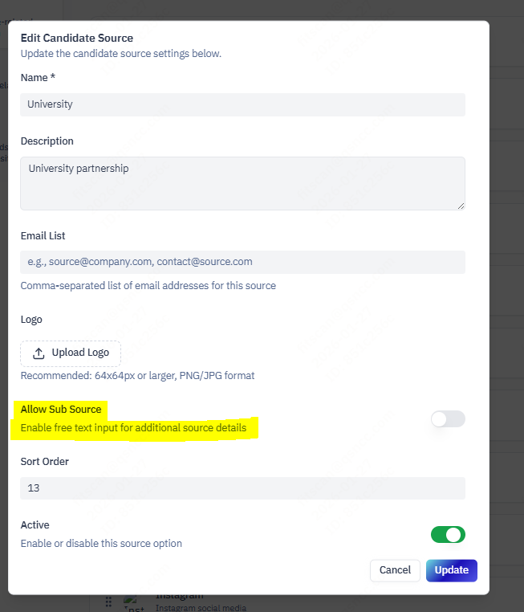

# Candidate Source Management

## The Story of Attribution

| Feature | Description |
| :--- | :--- |
| **What** | A module to track and manage where your candidates come from. |
| **Who** | **Recruiters** (Attribution) and **Admins** (Configuration). |
| **When** | When adding a new candidate or analyzing marketing ROI. |
| **Why** | To understand which channels (LinkedIn, Referrals, Job Boards) provide the best talent. |
| **Where** | **Settings > Data Configuration** and the **Candidate List**. |
| **How** | 1. Configure Sources in **Settings**   2. Open Candidate List   3. Click **Source Column**   4. Select **"LinkedIn"** and add sub-source **"Direct Message"** |

## 1. Configuring Sources (Admin)

Before tracking, define your channels.
1.  Navigate to **Settings > Data Configuration**.
2.  Select **"Sources"** or **"Candidate Source Management"**.
3.  **Add Source**:
    *   **Name**: Display name (e.g., "Agency X").
    *   **Logo**: Upload a brand icon for visual recognition in the list.
    *   **Allow Sub-Source**: Enable this if you need granular detail (e.g., specific campaign names).

### 2.2 Sub-Sources
If the selected source permits (e.g., "Referral"), a text field appears.
*   **Example**: Select "Referral" -> Type "John Doe" in the sub-source field.
*   This allows precise tracking of who referred whom.
*   

## 3. Filtering by Source
Use the **Advanced Filter** sidebar to view:
*   "Show me all candidates from *LinkedIn*."
*   "Show me all candidates from *Agency*."
This helps identifying high-performing channels.
