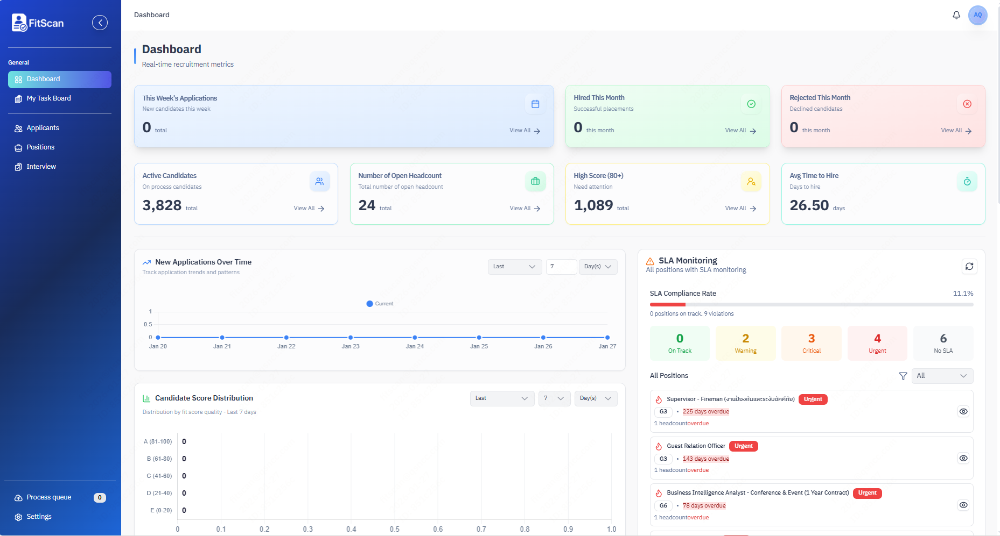
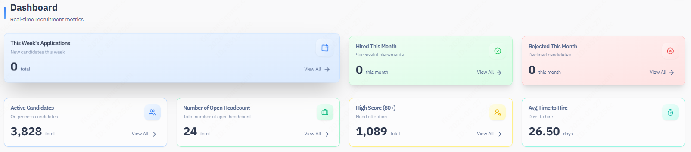
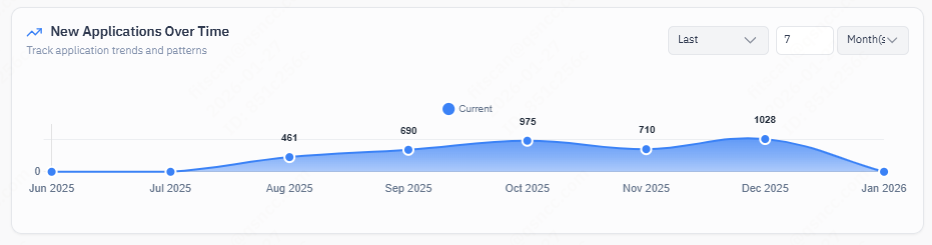
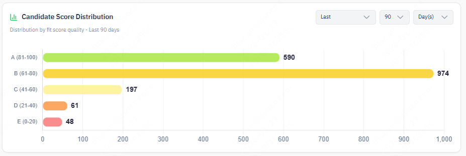
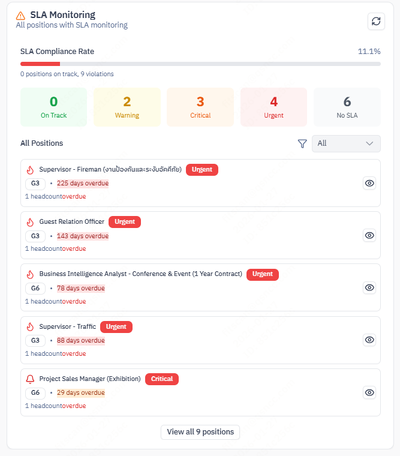

# Dashboard Overview

## The Story of Your Command Center

| Feature | Description |
| :--- | :--- |
| **What** | The central landing page summarizing recruitment velocity, pipeline health, and urgent actions. |
| **Who** | **All Users** (Recruiters, Hiring Managers, Admins). |
| **When** | Every morning to spot bottlenecks and prioritize the day's work. |
| **Why** | To provide a high-level "Pulse Check" prevents candidates from falling through cracks. |
| **Where** | The **Home** icon in the sidebar. |

## 1. Key Metrics (The Top Bar)

A real-time snapshot of your workload.
*   **Total Active Candidates**: Count of all candidates currently in progress (not Rejected/Hired).
*   **Open Positions**: Number of roles currently accepting applications.
*   **Interviews Today**: (If available) Count of scheduled sessions.

## 2. Analytics Charts
Understand trends without running complex reports.

### 2.1 New Applications (Time Series)

*   **What**: A line graph showing the volume of new applicants over the last 30 days.
*   **Why**: Spot trends.
    *   *Spike*: Marketing campaign worked.
    *   *Drop*: Job posting might have expired or market interest is cooling.

### 2.3 AI Score Distribution (Histogram)

*   **What**: Groups candidates by their Fit Score (e.g., how many are >85%?).
*   **Why**: Validates JD quality.
    *   *Skewed Right (High Scores)*: Good candidates, or JD is too easy.
    *   *Skewed Left (Low Scores)*: JD might be unrealistic or mismatched with the talent pool.

### 2.4 SLA Violations (Widget)

*   **What**: A list of candidates exceeding the "Time-in-Stage" limits set by Admins.
*   **Action**: Click on any red alert to jump directly to that candidate and unblock them.

## 3. Actionable Widgets
*   **My Tasks**: (See [Task Management](./Tasks.md)) A quick view of your top-priority personal to-dos.
*   **Recent Activity**: A live feed of what's happening in your workspace (New Applications, Stage Moves).

## 4. How to Verify (Test Case)
To test the live data connection:
1.  **Navigate**: Note the "Total Active Candidates" number.
2.  **Act**: Go to **Candidates > Add Candidate** and uploading a dummy resume.
3.  **Confirm**: Return to the **Dashboard**. The counter should have incremented by 1 immediately (or after a quick refresh).
