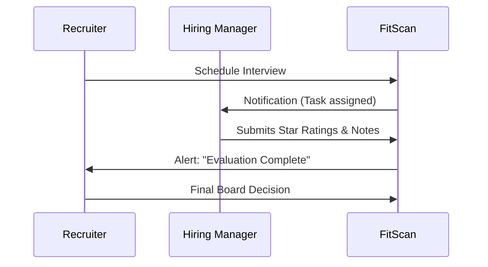

# Screening & Evaluation

## The Story of Moving Forward

| Feature | Description |
| :--- | :--- |
| **What** | The orchestration of candidate movement through the hiring pipeline and collaborative scoring. |
| **Who** | **Recruiters** (for pipeline management) and **Hiring Teams** (for evaluations). |
| **When** | Daily, as candidates progress from initial screening to final interview. |
| **Why** | To ensure every hire is backed by data and that the process is transparent across the organization. |
| **Where** | On the **Kanban Board** for movement and the **Profile > Evaluate** section for scoring. |
| **How** | 1. Drag & drop candidate to **"Screening"**   2. Open **Profile > Evaluate**   3. Click **"Submit Scorecard"**   4. Verify **Fit Score** updates in real-time |

## 1. Moving Candidates (Kanban)
The Kanban board is your visual control center. Drag and drop cards to progress candidates:
- **Applied → Screening**: Mark as ready for initial review.
- **Screening → Shortlist**: Present the candidate to the Hiring Manager.
- **Interviewing**: Triggers scheduling tasks for the team.

> [!NOTE]
> Moving a candidate to "Rejected" or "Hired" can be configured to automatically send email notifications.

## 2. Collaborative Evaluations
Bridge the gap between recruiters and managers through a shared feedback loop:

## 3. The AI Fit Score
The system assigns a **0-100% score** to help you prioritize large volumes of applicants:
- **High Score (Green)**: Prioritize these. AI suggests they match $ >85\% $ of the JD requirements.
- **Medium Score (Yellow)**: Potential matches that need manual CV verification.
- **Low Score (Red)**: Likely mismatches; examine keywords carefully.

## 4. How to Verify (Test Case)
To test pipeline movement:
1.  **Navigate**: Go to the **"Kanban"** view of a position.
2.  **Act**: Drag a candidate from **"New"** to **"Screening"**.
3.  **Confirm**: Open the candidate's profile and check the **"Activity"** tab. It should show a new transition record logged with your name and the timestamp.

