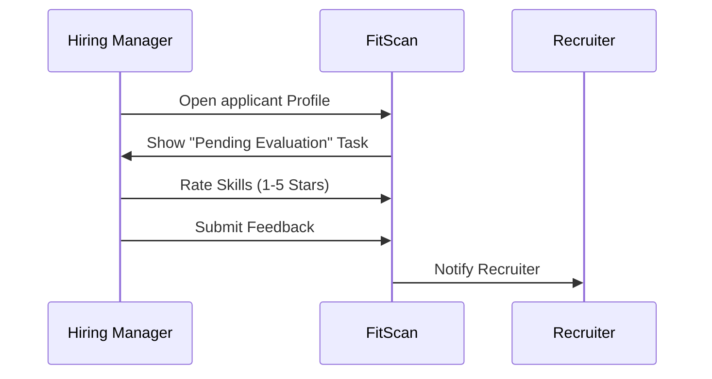

# Interviewing & Scoring

## The Story of Evaluation

| Feature | Description |
| :--- | :--- |
| **What** | A quantitative and qualitative assessment of a applicant's skills and cultural fit. |
| **Who** | **Hiring Managers** and designated **Interviewers** assigned to the hiring team. |
| **When** | Immediately after a formal interview occurs, ensuring the details are fresh in the interviewer's mind. |
| **Why** | To ensure every applicant is judged against the same criteria and to provide the recruitment team with actionable data for the final hiring decision. |
| **Where** | Inside the **applicant Profile** under the **"Start Evaluation"** action button. |
| **How** | 1. Open applicant Profile   2. Click **"Start Evaluation"**   3. Rate Skills (1-5 Stars)   4. Add Strengths/Red Flags   5. Click **"Submit Scorecard"** |

## 1. The Evaluation Process
When you conduct an interview, you must submit a scorecard to capture structured feedback.

## 2. Filling the Scorecard
1. **Star Ratings**: Rate each technical skill and personality trait defined in the job description.
2. **Key Strengths**: Provide bullet points on specific examples where the applicant exceeded expectations.
3. **Red Flags**: Document any concerns regarding technical gaps or communication issues.
4. **Recommendation**: Choose from: Hire / Strong Hire / No Hire.

## 3. How to Verify (Test Case)
To ensure your evaluation is correctly captured:
1.  **Navigate**: Go to a applicant profile where you are an interviewer.
2.  **Act**: Complete the 1-5 star ratings for all skills and click **"Submit Scorecard"**.
3.  **Confirm**: Refresh the page; the **"Start Evaluation"** button should now be replaced by a summary of your scores, and the task should disappear from your Dashboard.

