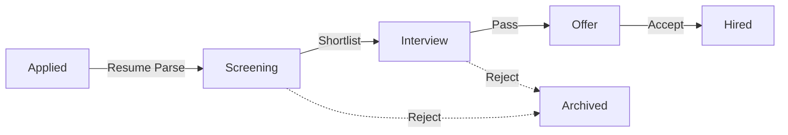

# Candidate Sourcing

## The Story of Talent Acquisition

| Feature | Description |
| :--- | :--- |
| **What** | The engine for discovery, data entry, and management of the recruitment funnel. |
| **Who** | **Recruiters** responsible for filling open positions. |
| **When** | From the moment a new applicant is discovered until they are successfully hired. |
| **Why** | To maintain a clean, high-velocity talent pool and eliminate manual data entry through AI parsing. |
| **Where** | Centrally managed within the **Candidates** module. |
| **How** | 1. Go to **Candidates**   2. View the **Master List**   3. Verify AI Skill Parsing   4. Use **"AI Search"** bar for natural language query |

### 1. The Candidate Master List
The master list provides a real-time overview of all applicants.

### 2. Advanced Filtering
The list can be sliced and diced to find the right talent:

| Filter | Description |
| :--- | :--- |
| **AI Search** | Natural language queries (e.g., *"Sales manager with 5 years experience in SaaS"*). |
| **Fit Score** | `>85%` (High), `60-85%` (Medium), `<60%` (Low). |
| **Pipeline Stage** | View only candidates in `Screening`, `Interview`, or `Offer`. |
| **Job Title** | Filter pool by the specific applied role. |
| **Source** | See candidates from `LinkedIn`, `Job Board`, or `Referral`. |

## 1. Recruitment Funnel
Candidates move through a defined lifecycle. The platform automates the transitions to keep your pipeline moving:

## 2. Managing Candidates (CRUD)
Detailed guide to building and maintaining your talent pool.
    
### 2.1 Adding Candidates
You can add talent into the system using three primary methods:
    
#### A. Resume Upload (Recommended)
*   **Action**: Drag & Drop PDF/DOCX files into the upload zone.
*   **AI Parsing**: The system automatically extracts:
    *   **Contact**: Email, Phone, LinkedIn URL.
    *   **Experience**: Current Title, Years of Experience, Past Companies.
    *   **Skills**: Technical and Soft skills matched against job criteria.

#### B. Manual Entry
Used for walk-ins or referrals without a resume file.
1.  Click **"Add Candidate"**.
2.  Fill in required fields:

| Field | Description | Mandatory |
| :--- | :--- | :--- |
| **First/Last Name** | Candidate's legal name. | Yes |
| **Email** | Unique identifier for the system. | Yes |
| **Phone** | Contact number. | No |
| **Applied Position** | Links candidate to a specific job ID. | No (Generic pool) |
| **Source** | Origin (e.g., LinkedIn, Reference, Job Board). | Yes |

#### C. Bulk Import
Process entire folders or legacy data:
*   **Archive Upload**: Upload a `.zip` file containing multiple PDF resumes.
*   **CSV Import**: Use the [Template](./admin/CLI%20Tools.md) to migrate data from other ATS.

### 2.2 Editing Profile Data
1.  Click on any candidate name to open the **Detail View**.
2.  Click **"Edit Profile"** to modify personal details.
    *   *Note: AI Fit Scores will re-calculate if you modify skills or experience.*
    
### 2.3 Updating Status
Move candidates through the funnel manually if needed:
1.  Open the **Detail View**.
2.  Change the **Stage** dropdown (e.g., "Screening" → "Interview").
3.  The system will prompt to send an email notification (optional).

## 3. Export & Import Data
**Location:** `Candidates > three-dot menu (...)`

- **Export to Excel**: Generate reports for stakeholders, including Status and AI Fit Scores.
- **Import Data**: Bulk-migrate history from legacy ATS systems using a standardized CSV.

## 4. How to Verify (Test Case)
To ensure sourcing is working:
1.  **Navigate**: Click on **"Applicants"** and use the **"Upload"** button.
2.  **Act**: Drag and drop a standard PDF resume.
3.  **Confirm**: The system should automatically extract the candidate's name, email, and skills. Verify these appear correctly in the profile without manual typing.

