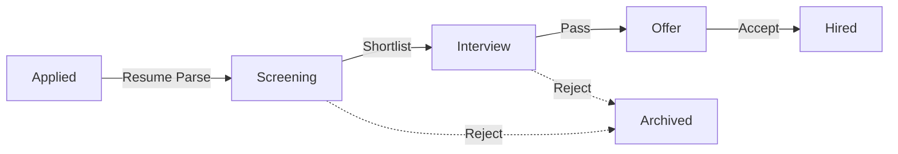

# Candidate Sourcing

## The Story of Talent Acquisition

| Feature | Description |
| :--- | :--- |
| **What** | The engine for discovery, data entry, and management of the recruitment funnel. |
| **Who** | **Recruiters** responsible for filling open positions. |
| **When** | From the moment a new applicant is discovered until they are successfully hired. |
| **Why** | To maintain a clean, high-velocity talent pool and eliminate manual data entry through AI parsing. |
| **Where** | Centrally managed within the **Candidates** module. |
| **How** | 1. Go to **Candidates**   2. View the **Master List**   3. Verify AI Skill Parsing   4. Use **"AI Search"** bar for natural language query |

### 1. The Candidate Master List
The master list provides a real-time overview of all applicants.

## 1. Recruitment Funnel
Candidates move through a defined lifecycle. The platform automates the transitions to keep your pipeline moving:

## 2. Adding Candidates
You can add talent into the system using three primary methods:
1. **Resume Upload**: Drag & Drop PDF/DOCX files. The AI instantly extracts experience, contact info, and skills.
2. **Manual Entry**: For referrals or walk-ins where a resume isn't yet available.
3. **Bulk Import**: Process entire folders of resumes at once via `.zip` upload.

## 3. Export & Import Data
**Location:** `Candidates > three-dot menu (...)`

- **Export to Excel**: Generate reports for stakeholders, including Status and AI Fit Scores.
- **Import Data**: Bulk-migrate history from legacy ATS systems using a standardized CSV.

## 4. How to Verify (Test Case)
To ensure sourcing is working:
1.  **Navigate**: Click on **"Applicants"** and use the **"Upload"** button.
2.  **Act**: Drag and drop a standard PDF resume.
3.  **Confirm**: The system should automatically extract the candidate's name, email, and skills. Verify these appear correctly in the profile without manual typing.

