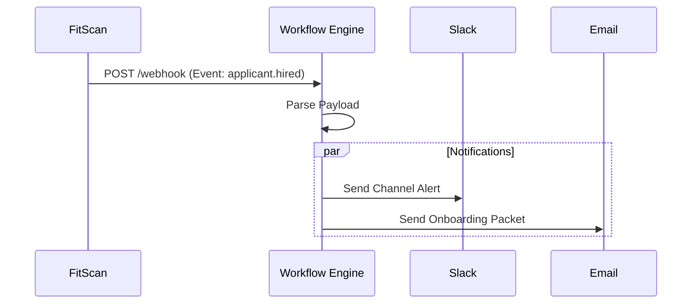

# Integrations & API

## The Story of Connected Workflows

| Feature | Description |
| :--- | :--- |
| **What** | Connections for automated data exchange between FitScan and external tools (Slack, Teams, N8N). |
| **Who** | **Technical Architects** and **Automations Engineers**. |
| **When** | When scaling the hiring process or building custom notification workflows. |
| **Why** | To eliminate "Copy-Paste" recruitment by making FitScan the single source of truth for all HR data. |
| **Where** | Under the **Settings > Integrations** menu. |
| **How** | 1. Configure Webhook URL   2. Select subscription events   3. Generate **API Key**   4. Copy `sk_live_...` secret safely   5. Test connection with external tool |

## 1. Automations (Webhooks)
Generate triggers that notify other systems based on platform events.

### 1.1 Webhook Configuration
1.  Navigate to **Settings > Integrations**.
2.  **Webhook URL**: Paste the endpoint from your external tool (e.g., N8N or Zapier).
3.  **Events**: Select triggers like `applicant_hired`, `job_created`, or `scorecard_submitted`.
4.  **Verification**: Click **"Test Connection"** to send a sample payload to your URL.
- **Trigger**: "applicant stage changed to Hired."
- **Action**: N8N automatically sends an onboarding email and posts a "Congratulations" message to Slack.

## 2. Programmatic Access (API)
Securely connect your own internal tools to the platform:
- **API Keys**: Generate `sk_live_...` secrets for secure authentication.
- **Revocation**: Instantly kill a key if it is accidentally exposed in client-side code.

> [!WARNING]
> API keys grant full administrative access to your applicant data. Never share them in public repositories or via unencrypted chat.

## 3. How to Verify (Test Case)
To verify your API key:
1.  **Navigate**: Go to **"Settings > Integrations"** and generate a new key.
2.  **Act**: Use a tool like `curl` or Postman to request `GET /api/v1/health` using the header `Authorization: Bearer YOUR_KEY`.
3.  **Confirm**: You should receive a successful response, proving that your external tool can securely talk to the platform.
