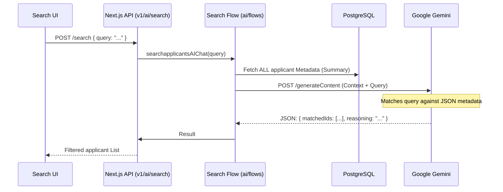

# AI Search Flow

**Project:** FitScan Enterprise
**Version:** 1.0
**Last Updated:** December 16, 2025
**Status:** Active
**Classification:** Internal

---

## 1. Search Architecture

---

## 2. Smart Extraction Logic

### 1. High-Precision Matching
The system uses a strict **system prompt** that enforces "Exact Matching Only" to prevent AI hallucinations.
- **No Semantic Inference**: If a user asks for "React", the AI won't return "Angular" developers unless they also have React.
- **Normalization**: Automatically handles cases like "TOEIC", "toeic-score", and "Toeic" as identical identifiers.

### 2. Contextual Summary Generation
Before sending data to Gemini, the system builds a concise `applicantSummary` for every applicant in the database:
- Aggregates **Education**, **Experience**, and **Skills**.
- Includes **Custom Attributes** (e.g., salary expectations, certifications).
- Streams these summaries to the AI to minimize token usage while maximizing relevant context.

### 3. AI Reasoning
The search results include an `aiReasoning` field which explains **why** a specific applicant was matched (e.g., "applicant X mentions TOEIC score 850 in their custom fields").

---

## 3. Supported Query Types

| Query Type | Example |
| :--- | :--- |
| **Certifications** | "Who has a CPA license?" |
| **Language** | "applicants with native English and Thai." |
| **Skill Depth** | "Experienced Python devs with > 5 years." |
| **Fit Scores** | "Fit score between 80% and 90%." |
| **Logic** | "Hired in 2024 but no longer at Company X." |
