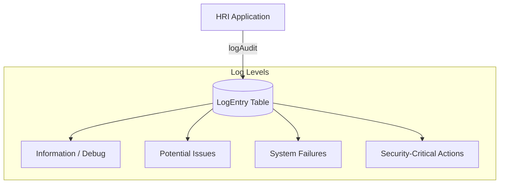

# Audit & Activity Tracking

**Project:** HRI Enterprise
**Version:** 1.0
**Last Updated:** December 16, 2025
**Status:** Active
**Classification:** Internal

---

## 1. Logging Architecture

The system distinguishes between general **System Logs** and high-level **Audit Events**.

---

## 2. Tracking Workflows

### 1. System Logging (`auditLog.ts`)
The `logAudit()` function captures:
- **Level**: The severity of the event.
- **Source**: The exact function or API endpoint where it occurred.
- **Actor**: The `actingUserId` (if the action was performed by a user).
- **Details**: A JSONB blob containing the "before and after" state or error stack traces.

### 2. Security Safeguards
- **FK Validation**: Before logging, the system verifies `actingUserId` exists to prevent database foreign key violations.
- **Console Fallback**: If the database is unreachable, the logger falls back to `console.error` to ensure no trace is lost.

---

## 3. Key Audited Actions

| Activity Type | Description | Tracked Data |
| :--- | :--- | :--- |
| **Auth Events** | Logins, MFA attempts, password resets. | IP, Browser, Success/Fail |
| **Data Mutatons** | Changes to applicants, Positions, or Salaries. | JSON diff of changes |
| **File Access** | Resume downloads or signed URL generation. | File path, User ID |
| **Auth Policy** | API Key creation or deletion. | Key Name, Prefix |

---

## 4. Data Retention & Visibility
Audit logs are stored for **90 days** by default. Admins can view and filter these logs through the **Admin > System Logs** interface to investigate discrepancies or security incidents.
