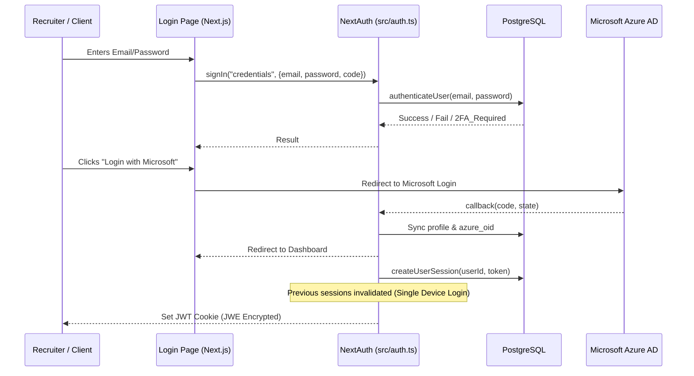

# Authentication Flow

**Project:** HRI Enterprise
**Version:** 1.0
**Last Updated:** December 16, 2025
**Status:** Active
**Classification:** Internal

---

## 1. Overview

HRI implements a robust, multi-layered authentication system using **NextAuth.js v5 (Auth.js)** for user sessions and **System API Keys** for programmatic access.

---

## 2. Authentication Methods

The system supports three primary ways to authenticate:

1.  **Azure AD SSO**: Enterprise-grade Single Sign-On.
2.  **Credentials (Email/Password)**: Secure local account management with optional **2FA (TOTP)**.
3.  **V2 API Keys**: For external automation (n8n, CI/CD).

---

## 3. Login Flow Sequence

---

## 4. Key Security Features

### 4.1 Single-Device Login Enforcement
Every time a user signs in, a unique `sessionToken` is generated and stored in a hidden JWT field and the database.
- If the user logs in on a new device, the old `sessionToken` is invalidated in the DB.
- The `session()` callback in `src/auth.ts` checks this token on **every request**. If the token doesn't match the current DB state, the user is instantly logged out.

### 4.2 Middleware Protection (`src/middleware.ts`)
The Next.js Middleware acts as a gatekeeper:
- **Cookie Check**: Inspects headers for `next-auth.session-token` or `authjs.session-token`.
- **Route Guarding**: Redirects unauthenticated users to `/auth/signin` for all protected routes (e.g., `/dashboard`, `/applicants`).
- **Rate Limiting**: Applies tiered limits (higher for API, stricter for Login/Auth).

### 4.3 API V2 Authentication
For external systems like **n8n**:
- The client calls `POST /api/v2/auth/login` with an `X-API-Key`.
- The app validates the key hash in the `SystemApiKey` table.
- A standard **NextAuth JWE** token is returned, which the client uses in subsequent `Authorization: Bearer <token>` headers.

### 4.4 Roles & Permissions
- Initial roles are defined in the `User` table (e.g., `Admin`, `Recruiter`).
- Granular permissions are loaded from `UserGroup` but are primarily handled server-side via the `requireSessionAndPermission()` helper to minimize JWT payload size.

---

## 5. Session Configuration

| Feature | Web Strategy | Mobile Strategy |
| :--- | :--- | :--- |
| **Strategy** | JWT (Stateless check) | JWT (Stateless check) |
| **Max Age** | 8 Hours | 3 Hours |
| **Update Age** | 24 Hours | 1 Hour |
| **Security** | `__Secure-` HTTP-only Cookie | `__Secure-` HTTP-only Cookie |
| **Idle Timeout** | Sliding window | Sliding window |

HRI implements a robust, multi-layered authentication system using **NextAuth.js v5 (Auth.js)** for user sessions and **System API Keys** for programmatic access.

---

## 🔐 Authentication Methods

The system supports three primary ways to authenticate:

1.  **Azure AD SSO**: Enterprise-grade Single Sign-On.
2.  **Credentials (Email/Password)**: Secure local account management with optional **2FA (TOTP)**.
3.  **V2 API Keys**: For external automation (n8n, CI/CD).

---

## 🔄 Login Flow Sequence

---

## 🛡️ Key Security Features

### 1. Single-Device Login Enforcement
Every time a user signs in, a unique `sessionToken` is generated and stored in a hidden JWT field and the database.
- If the user logs in on a new device, the old `sessionToken` is invalidated in the DB.
- The `session()` callback in `src/auth.ts` checks this token on **every request**. If the token doesn't match the current DB state, the user is instantly logged out.

### 2. Middleware Protection (`src/middleware.ts`)
The Next.js Middleware acts as a gatekeeper:
- **Cookie Check**: Inspects headers for `next-auth.session-token` or `authjs.session-token`.
- **Route Guarding**: Redirects unauthenticated users to `/auth/signin` for all protected routes (e.g., `/dashboard`, `/applicants`).
- **Rate Limiting**: Applies tiered limits (higher for API, stricter for Login/Auth).

### 3. API V2 Authentication
For external systems like **n8n**:
- The client calls `POST /api/v2/auth/login` with an `X-API-Key`.
- The app validates the key hash in the `SystemApiKey` table.
- A standard **NextAuth JWE** token is returned, which the client uses in subsequent `Authorization: Bearer <token>` headers.

### 4. Roles & Permissions
- Initial roles are defined in the `User` table (e.g., `Admin`, `Recruiter`).
- Granular permissions are loaded from `UserGroup` but are primarily handled server-side via the `requireSessionAndPermission()` helper to minimize JWT payload size.

---

## 📋 Session Configuration

| Feature | Web Strategy | Mobile Strategy |
| :--- | :--- | :--- |
| **Strategy** | JWT (Stateless check) | JWT (Stateless check) |
| **Max Age** | 8 Hours | 3 Hours |
| **Update Age** | 24 Hours | 1 Hour |
| **Security** | `__Secure-` HTTP-only Cookie | `__Secure-` HTTP-only Cookie |
| **Idle Timeout** | Sliding window | Sliding window |
