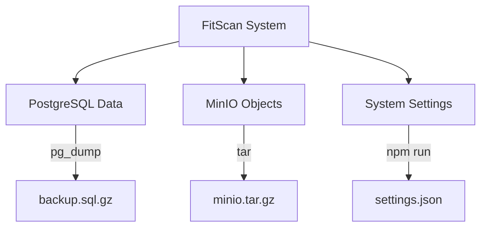

# Backup & Recovery Flow

**Project:** FitScan Enterprise
**Version:** 1.0
**Last Updated:** December 16, 2025
**Status:** Active
**Classification:** Internal

---

## 1. Backup Strategy

FitScan follows a tiered backup approach to protect the three core pillars of the system.

---

## 2. Recovery Workflow

| Step | Action | Tool |
| :--- | :--- | :--- |
| **1. Database** | Restore schema and records. | `psql` |
| **2. Storage** | Restore resume PDFs and avatars. | `tar -xz` |
| **3. Config** | Restore runtime environment variables. | `settings:import` |
| **4. Verify** | Run application health checks. | `GET /api/health` |

---

## 3. Automated Tasks

### Daily Snapshots
The system is configured with a **Crontab** (by default at 02:00 AM) that performs:
1.  **DB Dump**: Compresses the entire PostgreSQL database.
2.  **Object Sync**: Backs up the MinIO `candidatrack_minio_data` volume.
3.  **Rotation**: Keeps the last 30 daily backups, deleting older ones to save space.

### Migration Management
For major infrastructure moves, specialized scripts like `migrate_minio_mc.py` are used to sync data between S3 buckets while preserving metadata and permissions.

---

## 4. Disaster Recovery (DR) Scenarios
- **Node Failure**: Kubernetes automatically redeploys pods; data is persistent via **StatefulSets**.
- **Data Corruption**: Revert to the previous night's backup at 02:00 AM.
- **Service Outage**: Check `LogEntry` for "ETIMEDOUT" or "ECONNREFUSED" to identify if the DB or MinIO is the bottleneck.
