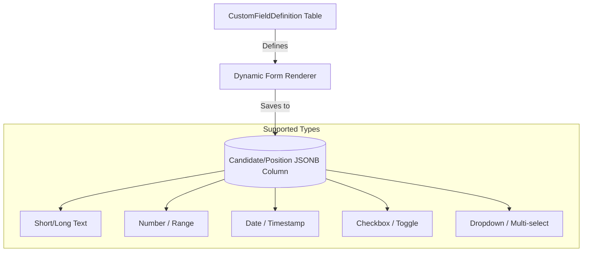

# Custom Field System

**Project:** FitScan Enterprise
**Version:** 1.0
**Last Updated:** December 16, 2025
**Status:** Active
**Classification:** Internal

---

## 1. Architecture Overview

The system relies on **JSONB columns** in core tables and a central definition table to manage them.



---

## 2. Key Components

### 1. `CustomFieldDefinition`
Stores metadata about the custom fields:
- **`name` & `key`**: The unique identifier in the JSON object (e.g., `expected_salary`).
- **`type`**: Determines the validation and UI component (e.g., `NUMBER`).
- **`entityType`**: Specifies if the field belongs to a **Candidate** or a **Position**.
- **`options`**: (Optional) List of values for dropdowns.

### 2. The JSONB Column (`customAttributes`)
Instead of adding new columns like `expected_salary` to the `Candidate` table, values are stored in a highly optimized `JSONB` blob:
```json
{
  "expected_salary": 85000,
  "notice_period": "30 days",
  "remote_preference": "Hybrid"
}
```

### 3. Dynamic Rendering
The frontend uses a generic form component that:
1. Fetches definitions for the current entity.
2. Dynamically renders the appropriate input (e.g., `Select` for `options`, `DatePicker` for `date`).
3. Handles normalization (e.g., ensuring numeric strings are stored as numbers).

---

## 3. Benefits of this Approach
- **Zero-Downtime Schema Changes**: New fields can be added via the Admin UI without migrations.
- **AI Compatibility**: The **AI Search** and **Matching** flows can easily parse the `customAttributes` JSONB to include these fields in their logic.
- **Reporting**: PostgreSQL's JSONB indexing allows for fast queries against these custom fields directly in SQL.
