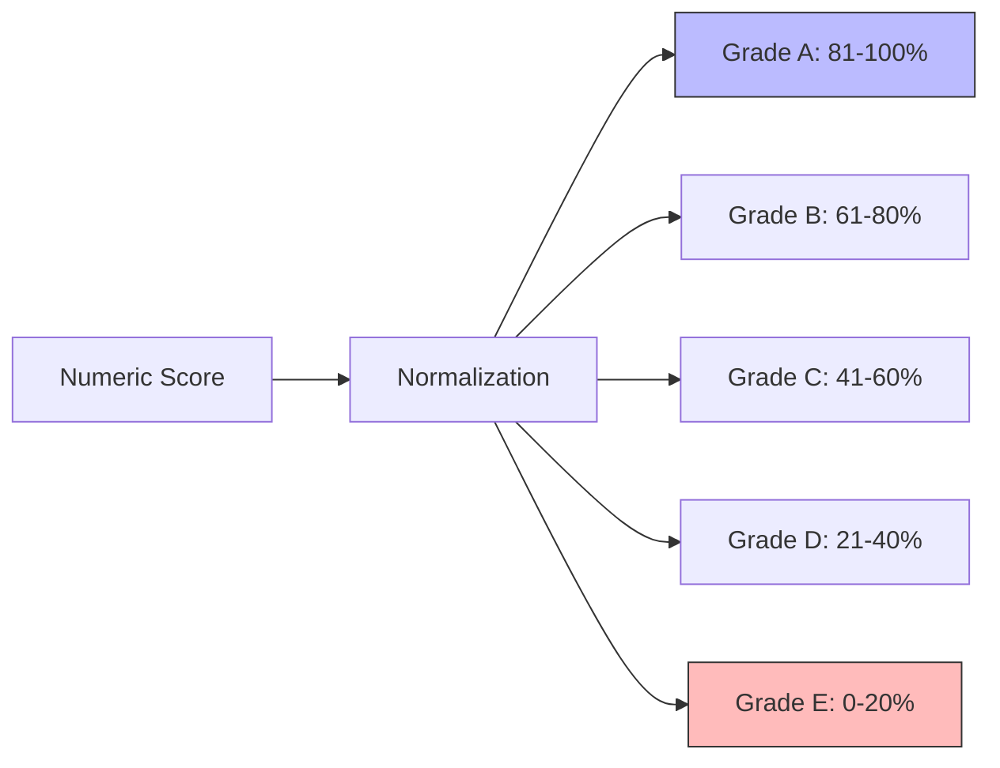
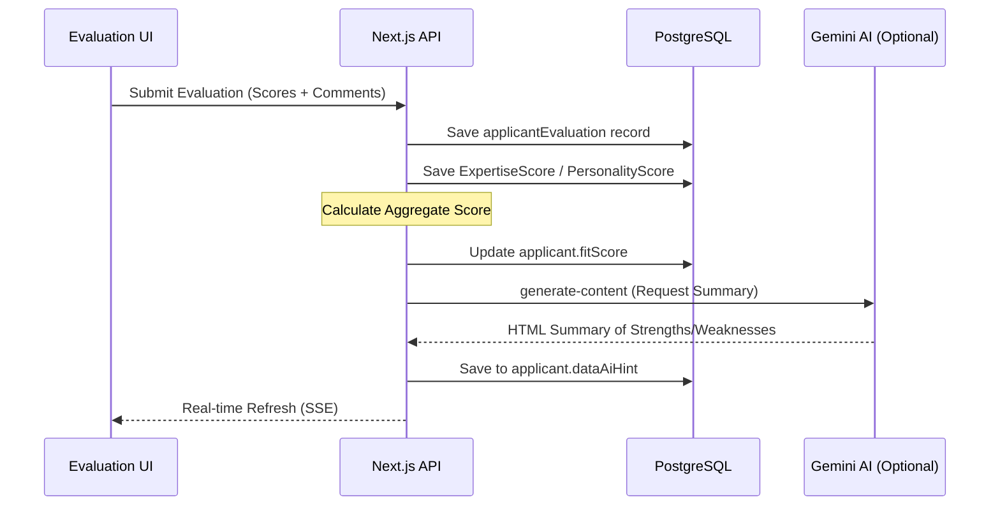

# Evaluation & Scoring Flow

**Project:** HRI Enterprise
**Version:** 1.0
**Last Updated:** December 16, 2025
**Status:** Active
**Classification:** Internal

---

## 1. Scoring Framework

All applicant assessments are normalized to a **0-100% scale**, which simplifies to a clean **A through E letter grade**.

---

## 2. Evaluation Process

---

## 3. Implementation Details

### 1. Score Normalization (`scoreUtils.ts`)
The system is designed to be resilient to different input formats:
- **Decimal**: 0.85 ➡️ 85%
- **Integer**: 85 ➡️ 85%
- **Out of Range**: Clamped to 0 or 100.

### 2. Expertise & Personality Modules
Evaluations are broken down into:
- **Expertise Skills**: Hard skills like "React", "SQL", "Project Management".
- **Personality Traits**: Soft skills like "Leadership", "Communication", "Adaptability".
These are stored in the `applicantExpertiseScore` and `applicantPersonalityScore` tables.

### 3. AI Analysis
After a human evaluator submits their scores, the system can trigger an **AI Summary Generation** (`/api/ai/generate-content`). 
- Gemini analyzes the raw scores, recruiter comments, and the applicant's transition history.
- It produces a professional HTML summary used in meeting notes and hiring manager reviews.

---

## 4. Grade Reference Table

| Grade | Range | Performance Level | UI Background |
| :--- | :--- | :--- | :--- |
| **A** | 81-100% | Exceptional / Top Talent | `bg-green-200` |
| **B** | 61-80%  | Strong applicant | `bg-lime-200` |
| **C** | 41-60%  | Meets Expectations | `bg-yellow-200` |
| **D** | 21-40%  | Below Expectations | `bg-orange-200` |
| **E** | 0-20%   | Not Recommended | `bg-red-200` |
