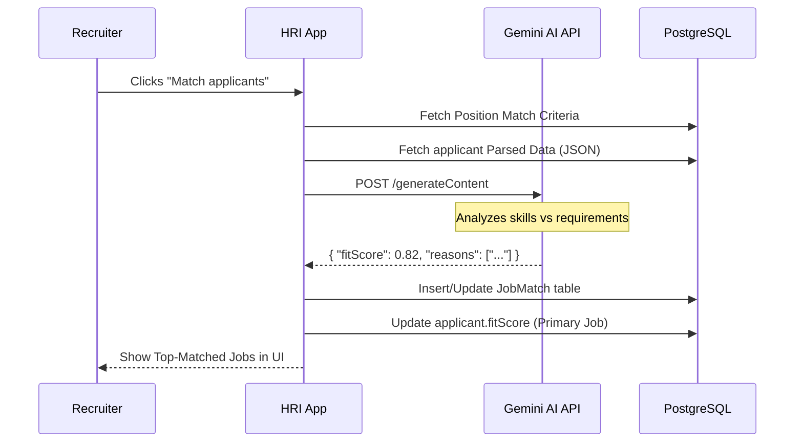

# AI Job Matching Flow

**Project:** HRI Enterprise
**Version:** 1.0
**Last Updated:** December 16, 2025
**Status:** Active
**Classification:** Internal

---

## 1. AI Matching Logic

The system uses **Google Gemini** models to perform context-aware matching, moving beyond simple keyword search.

---

## 2. Key Components

### 1. Match Criteria
Every `Position` has a `matchCriteria` field (JSONB) containing:
- Mandatory technical skills.
- Preferred certifications.
- Years of experience required for specific technologies.

### 2. JobMatch Table
Unlike a simple one-to-one link, the `JobMatch` table allows a applicant to be scored against **multiple positions**:
- **Fit Score**: A value from 0 to 1 representing the alignment.
- **Match Reasons**: AI-generated bullet points justifying the score.
- **Job Description Summary**: A shortened, AI-optimized version of the job requirements.

### 3. Model Management (`aiModelManager.ts`)
- **API Key Fallback**: Rotates through multiple Google AI keys to ensure high availability.
- **Dynamic Routing**: Can route light requests to `gemini-1.5-flash` and complex matching to `gemini-1.0-pro` or `gemini-2.0-flash`.

---

## 3. Matching Thresholds

| Fit Score | Label | Action Taken |
| :--- | :--- | :--- |
| **> 85%** | **Strong Match** | Instantly flagged for immediate Review. |
| **70-85%** | **Good Potential** | Standard screening queue. |
| **< 50%** | **Low Alignment** | Lower priority; AI provides "GAP analysis". |

---

## 4. Security & Privacy
- **Metadata Only**: The AI models are primarily sent structured JSON metadata rather than full raw files whenever possible to optimize tokens and privacy.
- **Audit Trails**: Every AI-generated match result is logged with the timestamp and the specific model version used.
