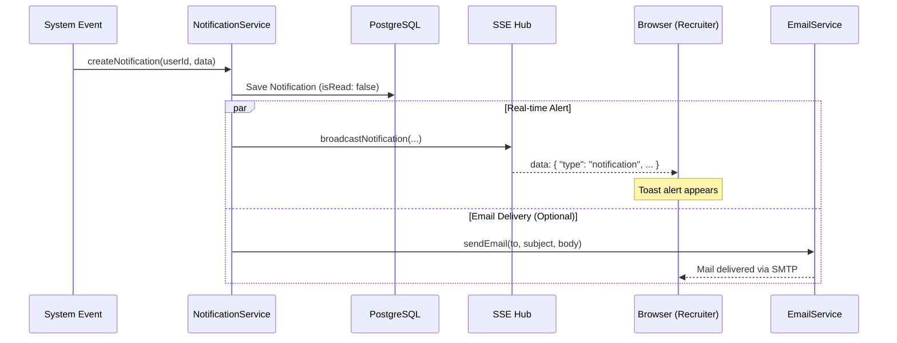

# Email & Notification Flow

**Project:** HRI Enterprise
**Version:** 1.0
**Last Updated:** December 16, 2025
**Status:** Active
**Classification:** Internal

---

## 1. Notification Lifecycle

---

## 2. Implementation Breakdown

### 1. In-App Notifications (`notificationService.ts`)
- **Persistence**: Every alert is saved to the `Notification` table, allowing users to view their history.
- **Self-Notification Prevention**: The system intelligently blocks notifications where the `actingUserId` is the same as the target `userId` (e.g., you don't get a notification when *you* update a applicant).
- **Real-time Link**: Uses the **SSE Mechanism** to push updates instantly to the browser without a page refresh.

### 2. Email Service (`emailService.ts`)
- **Engine**: Powered by **Nodemailer**.
- **Configuration**: Managed via System Settings (`emailSmtpHost`, `emailSmtpUser`, etc.) rather than hardcoded environment variables, allowing for runtime adjustments.
- **Fail-safe**: Includes a `testEmailConnection()` utility to verify SMTP health from the Admin dashboard.

---

## 3. Triggered Events

| Event Type | Logic | Recipient |
| :--- | :--- | :--- |
| **Position Assigned** | A recruiter is linked to a new job opening. | Assigned Recruiter |
| **applicant Added** | A new resume is successfully processed/uploaded. | Position Recruiter |
| **Status Changed** | A applicant moves to a new recruitment stage. | Position Recruiter |
| **SLA Alert** | A applicant has been stuck in a stage for too long. | Admin / Recruiter |

---

## 4. Configuration
 recruiters can toggle email alerts in their **Profile Preferences**. System-wide SMTP settings are located in the **Settings > System Configuration** tab.
